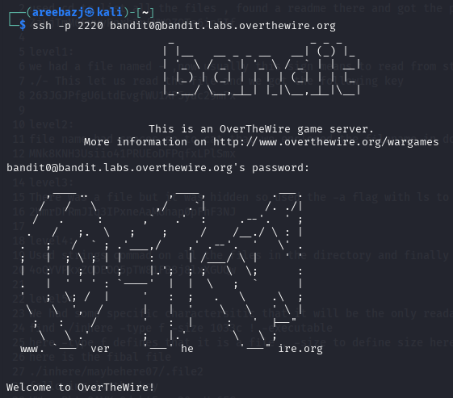

# BANDIT LEVEL 0

## GOAL:

- Login to the game using SSH
- host => bandit.labs.overthewire.org
- port => 2220
- username => bandit0
- password => bandit0

## SOLUTION:

To login we have to use SSH . Following is a basic syntax of the command which we will use.

`ssh -p <port_number> <username>@<host>`

`ssh -p 2220 bandit0@bandit.labs.overthewire.org`

