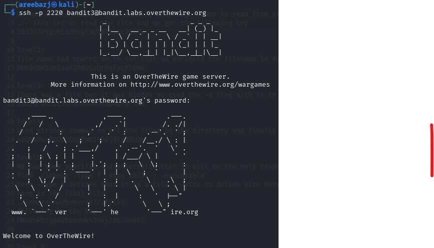

# BANDIT LEVEL 2 -> 3

## GOAL:

- Password for the level is in a file named spaces in this filename located in the home directory
- host => bandit.labs.overthewire.org
- port => 2220
- username => bandit3

## SOLUTION:

Use the following command to list all the files and directories .

`ls`

Here we can see a file named spaces in this filename , we used the following command to see it's content.

`cat <filename>`

`cat spaces in this filename `

But the above command won't give us the correct output as the file name has spaces so, to overcome this we will enclose the file name is double quotation marks as following:

`cat "spaces in this filename"`

Here we got the password, this password will be used further when we login to bandit3.

To login we have to use SSH . Following is a basic syntax of the command which we will use.

`ssh -p <port_number> <username>@<host>`

`ssh -p 2220 bandit3@bandit.labs.overthewire.org`

