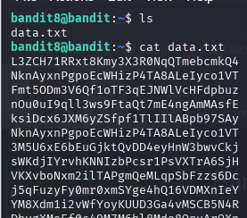
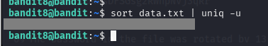

# BANDIT LEVEL 8 -> 9

## GOAL:

- The password for the next level is stored in the file data.txt and is the only line of text that occurs only once
- host => bandit.labs.overthewire.org
- port => 2220
- username => bandit9

## SOLUTION:

Before moving forward let us first take a look at the content of the file for which we will use the following commands:

`ls`

`cat data.txt`

It can be seen that the above file has alot of data and it is not efficient to go through every single line to find the specific password.

Now we know that the line in which we will have our password is unique and so we can use a command called `uniq` having a following basic syntax:

`uniq <file_name>`

Now since we only want unique lines to come in the output ignoring all the other lines we will look through the man page to see if we can find a relevant flag.

`man uniq`

Here it is a -u flag that fits the requirements.

But here comes a problem that the uniq command will only ignore the duplicates if they are consecutive so that means if a line is repeated but not consecutive it will treat them as two seperate rows.

To solve this problem we will use another command called `sort` .This command will sort all the data is ascending order making our duplicates come together. Here is how we can use it:

`sort <file_name>`

`sort data.txt`

Now , we will merge both commands using a pipe operator to get our final command:

`sort data.txt | uniq -u `

In this way we got our password as given above.

To login we have to use SSH . Following is a basic syntax of the command which we will use.

`ssh -p <port_number> <username>@<host>`

`ssh -p 2220 bandit9@bandit.labs.overthewire.org`

