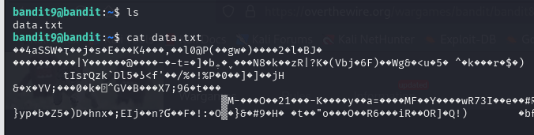
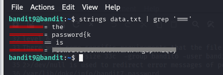

# BANDIT LEVEL 9 -> 10

## GOAL:

- The password for the next level is stored in the file data.txt in one of the few human-readable strings, preceded by several ‘=’ characters.
- host => bandit.labs.overthewire.org
- port => 2220
- username => bandit10

## SOLUTION:

We know that the password is in a file named data.txt in string format preceded by several '='. We will first list the files and see the contents of data.txt using following commands.

`ls`

`cat data.txt`

It can be seen that the above file has alot of data in different formats and it is not efficient to go through every single line to find the specific password.The data aslo messed up our terminal which we corrected using the `reset` command.

Here we can utilize a very useful command called 'grep'. It is used to search for a specific text or pattern in a file or input.Following is it's basic syntax:

`grep <options> <pattern> <file_name>`

since, the password is preceeded by several '='  we will use the following commnad:

`grep '===='`

Since grep alone without any flags won't work if we have binary data in a file (in our case) so here we have two options either search for an appropriate flag to use with grep or the second option which we used here as following:

We used `strings` command to filter strings then passed the output to grep as input using pipe operator. Here is the final command that we used and got the password.

`strings data.txt | grep '==='`

To login we have to use SSH . Following is a basic syntax of the command which we will use.

`ssh -p <port_number> <username>@<host>`

`ssh -p 2220 bandit10@bandit.labs.overthewire.org`

