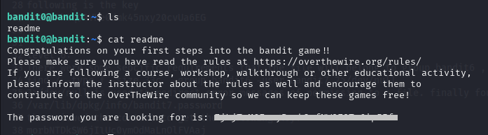
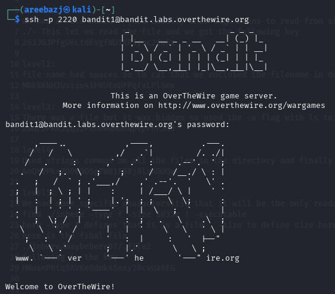

# BANDIT LEVEL 0 -> 1

## GOAL:

- Password for the level is in a readme file located in the home directory
- host => bandit.labs.overthewire.org
- port => 2220
- username => bandit1

## SOLUTION:

Use the following command to list all the files and directories .

`ls`

Here we can see a readme file , use the following command to see it's content.

`cat <filename>`

`cat readme`

Here we got the password, this password will be used further when we login to bandit1.

To login we have to use SSH . Following is a basic syntax of the command which we will use.

`ssh -p <port_number> <username>@<host>`

`ssh -p 2220 bandit1@bandit.labs.overthewire.org`

