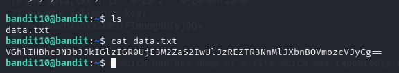
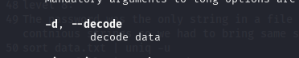
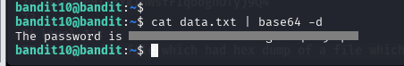
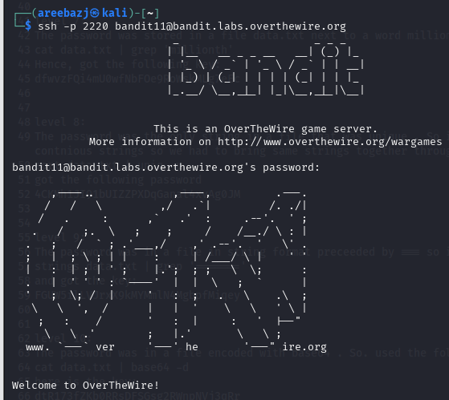

# BANDIT LEVEL 10 -> 11

## GOAL:

- The password for the next level is stored in the file data.txt, which contains base64 encoded data
- host => bandit.labs.overthewire.org
- port => 2220
- username => bandit11

## SOLUTION:

Before moving forward let us first take a look at the content of the file for which we will use the following commands:

`ls`

`cat data.txt`

The data is the file is encoded in base64 . To decode it we have two easy ways either to use any online tool or webiste like **CyberChef** or we have an amazing command called `base64`. Following is it's syntax:

`base64 <options> <file_name>`

Now, since we want to decode we will search for a relevant flag using man page

`man base64`

Here it is a -d flag that stands for decode.

Now we will print the contents of file using cat and then pass them as input to base64 using following command:

`cat data.txt | base64 -d`

In this way we got our password as given above.

To login we have to use SSH . Following is a basic syntax of the command which we will use.

`ssh -p <port_number> <username>@<host>`

`ssh -p 2220 bandit11@bandit.labs.overthewire.org`

