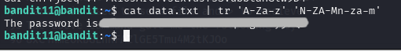

# BANDIT LEVEL 11 -> 12

## GOAL:

- The password for the next level is stored in the file data.txt, where all lowercase (a-z) and uppercase (A-Z) letters have been rotated by 13 positions
- host => bandit.labs.overthewire.org
- port => 2220
- username => bandit12

## SOLUTION:

Before moving forward let us first take a look at the content of the file for which we will use the following commands:

`ls`

`cat data.txt`

The data is the file is rotated by 13 positions. To bring it to the original form we have two easy ways 

1- To use any online tool or webiste like **CyberChef** . We can do it as follows:

2- Another way is that we have an amazing command called `tr` or **transalte**. Following is it's syntax:

`tr <options> <SET1> <SET2>`

Now, since we want to replace certain chracters with characters 13 ahead of them we will search for a relevant flag using man page

`man tr`

Here it is now, to define our characters we will use regex like expressions.

We will use `[A-Za-z] [N-ZA-Mn-za-m]`

The above will replace first half of chars from A-M to chars from N-Z which are exactly 13 ahead of them the same is done for other half and lowercase

In this way we got our password as given above.

To login we have to use SSH . Following is a basic syntax of the command which we will use.

`ssh -p <port_number> <username>@<host>`

`ssh -p 2220 bandit12@bandit.labs.overthewire.org`

