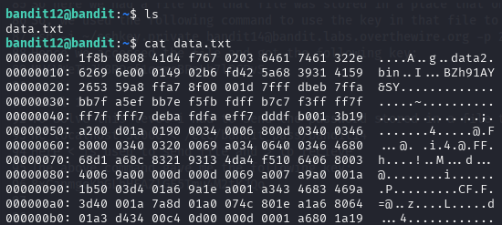
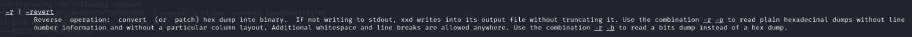
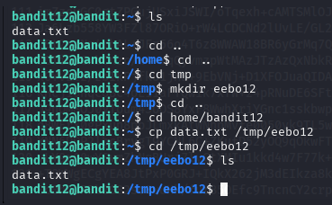
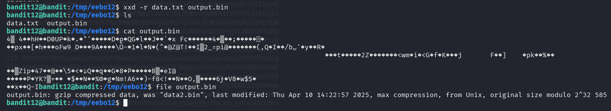
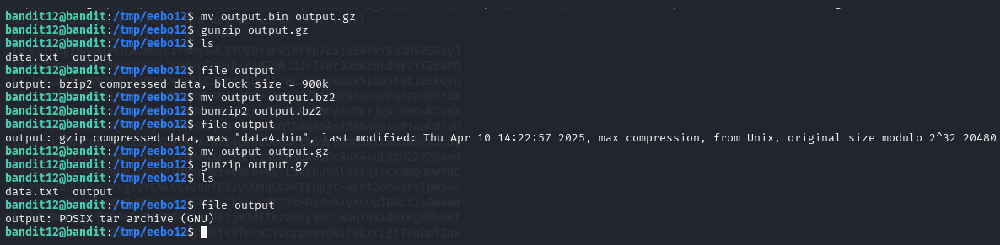
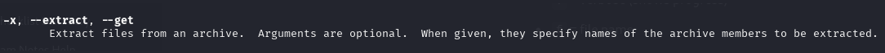
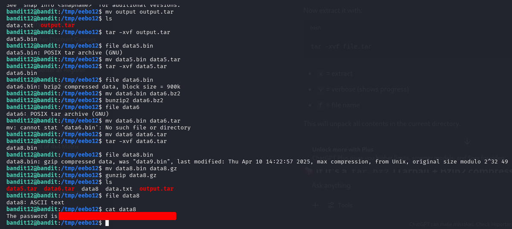
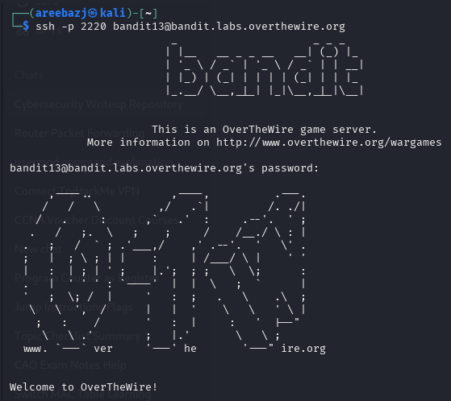

# BANDIT LEVEL 12 -> 13

## GOAL:

- The password for the next level is stored in the file data.txt
- It is hexdump of a file that has been repeatedly compressed. 
- For this level it may be useful to create a directory under /tmp in which you can work. Use mkdir with a hard to guess directory name. Or better, use the command “mktemp -d”. Then copy the datafile using cp, and rename it using mv (read the manpages!)
- host => bandit.labs.overthewire.org
- port => 2220
- username => bandit13

## SOLUTION:

Before moving forward let us first take a look at the content of the file for which we will use the following commands:

`ls`

`cat data.txt`

Since we know that file contains the hexdump of a repeatedly compressed file so we can first try to convert the hexdump into a file.But we don't know any tool for it what we do know is that there is a tool called `xxd` which is used to obtain hex dumps of a file(quite opposite of what we want) but we can explore it's man page to see if we can find any relevant flag.

`man xxd`

Got it! here is a -r flag that let's us do just exactly what we want.

Now we can't create a new file here in this folder as we don't have the required permissions so, for that we will create a new folder in the /tmp directory.

First we will navigate through the file system to find /tmp directory for which we will use the following commands

`cd ..` 

It is used to go one level back in the heirarchy.

`mkdir <directory_name>`

To create the directory

`cp <file_name> <dest_directory_name>`

And the above one to copy the file

Now we will do the conversion using the following command:

`xxd -r <input_file> <output_file>` 

`xxd -r data.txt output.bin`

After conversion we checked the contents of the file that were in binary , then we checked the file type using a commad called `file` It has a following syntax:

`file <file_name>`

We can see that the file is compressed with **gzip** but file doesn't have a proper extension i.e. **.gz** .So, first we will rename the file using the following command:

`mv <previous_name> <recent_name>`

`mv output.bin output.gz`

Then we will unzip it using the following command 

`gunzip <file_name>`

`gunzip output.gz`

After that we found out that the extracted file was compressed using another thing called **bzip2** and it also didn't have the respective **.bz2** extension so in the same way we renamed the file and used the following command to unzip it:

`bunzip2 <previous_name>  <recent_name>`

`bunzip2 output.bz2

Now we can see the file is a **tar** archive so to extract it we will need to use a command called `tar` but we know this command is used to create archive but how to extract from one? to check this we will open man page to find a relevant flag.

`man tar`

`-x` is a relevant flag . We will also add two more flags `-v` for verbosity we can also skip it and `-f` for file and following is the final command :

`tar -xvf <file_name>`

`tar -xvf output.tar`

Now we just repeatedly checked the file type,unzipped , extracted data from the file until we got the final ascii file in which we got our password as above.

To login we have to use SSH . Following is a basic syntax of the command which we will use.

`ssh -p <port_number> <username>@<host>`

`ssh -p 2220 bandit13@bandit.labs.overthewire.org`

