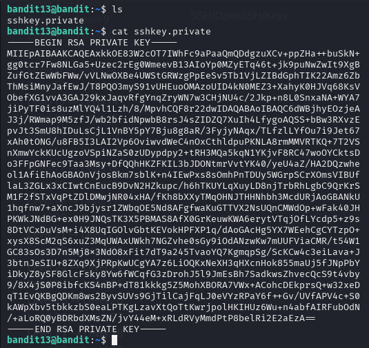
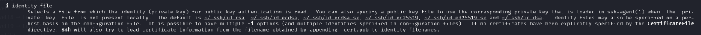
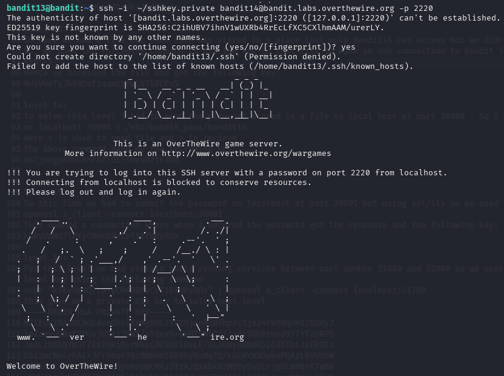
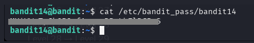

# BANDIT LEVEL 12 -> 13

## GOAL:

- The password for the next level is stored in /etc/bandit_pass/bandit14
- It can only be read by user bandit14. 
- For this level, you don’t get the next password, but you get a private SSH key that can be used to log into the next level. 
- Note: localhost is a hostname that refers to the machine you are working on
- host => bandit.labs.overthewire.org
- port => 2220
- username => bandit13

## SOLUTION:

Before moving forward let us first take a look at the content of the file for which we will use the following commands:

`ls`

`cat sshkey.private`

Above is our private ssh key . Before this we were always providing a password when an ssh connection was build but here we don't have it so we will search how we can make a connection using private key.For that we will explore the man page.

`man ssh`

Here we found a relevant flag `-i` that lets us provide an identity file (the file with our private key) to make the connection.

To login we have to use SSH . Following is a basic syntax of the command which we will use.

`ssh -i <private_key_location> <username>@<host> -p <port_number>`

`ssh -i ~/sshkey.private bandit14@bandit.labs.overthewire.org -p 2220`

We are successfully logged in. Now we will just serach for the file **/etc/bandit_pass/bandit14** and view it's content.

Here we got our key.

