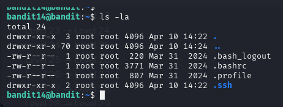
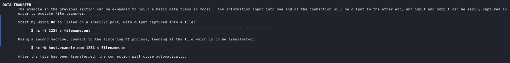
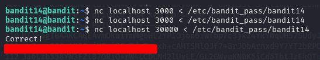

# BANDIT LEVEL 14 -> 15

## GOAL:

- The password for the next level can be retrieved by submitting the password of the current level to port 30000 on localhost.
- host => bandit.labs.overthewire.org
- port => 2220
- username => bandit15

## SOLUTION:

Before moving forward let us first list all the files to see if there is anything useful:

`ls -la`

Moving forward now, we have to make a connection with local host and send password to it for this we can take help of an amazing tool called **netcat (nc)**

**Netcat** is a command-line tool used for reading and writing data across network connections using TCP or UDP.

When we don't know how to use something we always go towards the documentation first so, again we will open the man page.

`man nc`

Above is a general format of how we can transfer files using netcat now, we will use the following commands to do it.

`nc <host_name> <port> < <file_name>`

`nc localhost 30000 < /etc/bandit_pass/bandit14`

Here we got our password which we will use to advance to the next level.

To login we have to use SSH . Following is a basic syntax of the command which we will use.

`ssh -p <port_number> <username>@<host>`

`ssh -p 2220 bandit15@bandit.labs.overthewire.org`

