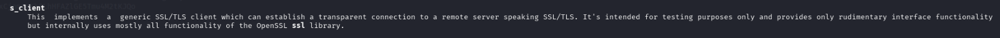
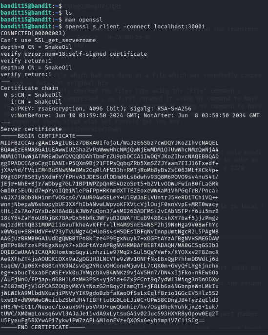
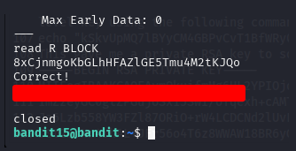
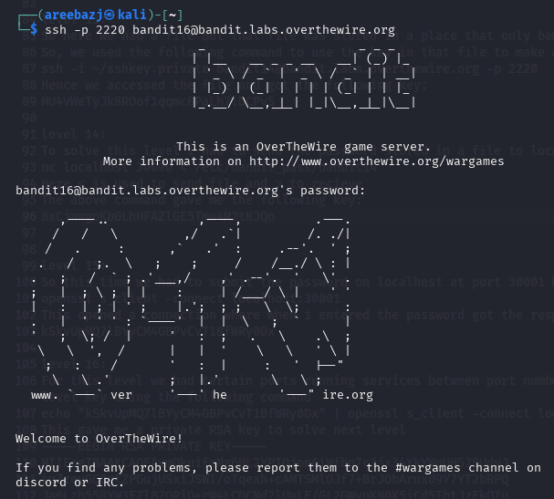

# BANDIT LEVEL 15 -> 16

## GOAL:

- The password for the next level can be retrieved by submitting the password of the current level to port 30001 on localhost using SSL/TLS encryption.
- host => bandit.labs.overthewire.org
- port => 2220
- username => bandit16

## SOLUTION:

So, this time we had to submit the password on localhost at port 30001 but using ssl/tls . For this we have a tool called **OpenSSL**.

**OpenSSL** is a powerful command-line tool and library used for creating, managing, and using cryptographic keys, certificates, and secure network connections using SSL/TLS protocols.

Again we will visit our old friend i.e. the man page

`man openssl`

The openssl s_client command is used to connect to a server over SSL/TLS, allowing you to test encrypted connections, inspect certificates, and manually communicate over HTTPS or other secure protocols.

So we will use the above command in the following way:

`openssl s_client -connect host:port`

`openssl s_client -connect localhost:30001`

As we can see, a connection is established we will now provide the password of this level to get the next level's password.

Here we got our password which we will use to advance to the next level.

To login we have to use SSH . Following is a basic syntax of the command which we will use.

`ssh -p <port_number> <username>@<host>`

`ssh -p 2220 bandit16@bandit.labs.overthewire.org`

