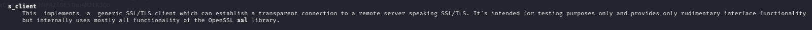
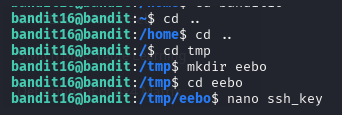

# BANDIT LEVEL 16 -> 17

## GOAL:

- The credentials for the next level can be retrieved by submitting the password of the current level to a port on localhost in the range 31000 to 32000. 
- First find out which of these ports have a server listening on them. 
- Then find out which of those speak SSL/TLS and which don’t.
 - There is only 1 server that will give the next credentials, the others will simply send back to you whatever you send to it.
- host => bandit.labs.overthewire.org
- port => 2220
- username => bandit17

## SOLUTION:

To find the open ports we will use a tool called **nmap** . It is a network scanning tool used to discover hosts, services, and vulnerabilities on a computer network.

We can use the following syntax to use search for open ports.

`nmap [options] <target>`

here since, we wanna search on the current host we will use `localhost` as target.

we are also given a certain range of ports to search for to so to limit our search to those we will use a `-p` flag .Following is the final command.

`nmap -p 31000-32000 localhost`

The scan shows that there are 5 open ports . No we will try to make connection on each port using ssl/tls to submit the password and observe the output. For this we have a tool called **OpenSSL**.

**OpenSSL** is a powerful command-line tool and library used for creating, managing, and using cryptographic keys, certificates, and secure network connections using SSL/TLS protocols.

Again we will visit our old friend i.e. the man page

`man openssl`

The openssl s_client command is used to connect to a server over SSL/TLS, allowing you to test encrypted connections, inspect certificates, and manually communicate over HTTPS or other secure protocols.

So we will use the above command in the following way:

`echo "<key>" | openssl s_client -connect host:port`

here we attached echo key with the connection using `|` operator so that we don't have to manually enter the key after connection is established and it directly enters the output of echo as input to connection.

Above is an example of a failed connection. We repeated this process for all 5 ports.

Finally we got a private ssh key using the above port.

Now , we will save this key to a file as we only have permissions to make new file in **/tmp** directory so we will make a new file there and save our key in it.

If a file has private key it must also have suitable permissions. Only the owner should be allowed to read or write to that. So , we will change the permissions using the following command:

`chmod 600 <file_name>`

here 6 means read and write for owner and 0 means no permissions for group and users.

To login we have to use SSH . Following is a basic syntax of the command which we will use.

`ssh -i <private_key_location> <username>@<host> -p <port_number>`

`ssh -i ~/sshkey.private bandit17@bandit.labs.overthewire.org -p 2220`

