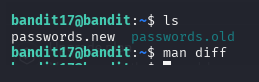
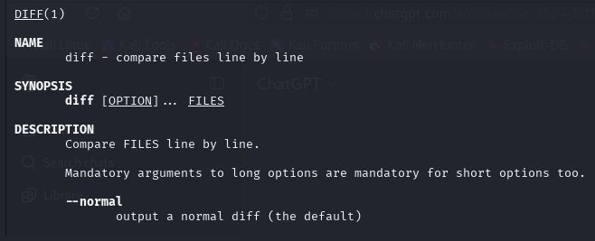
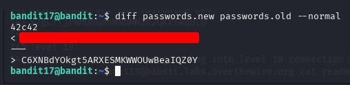
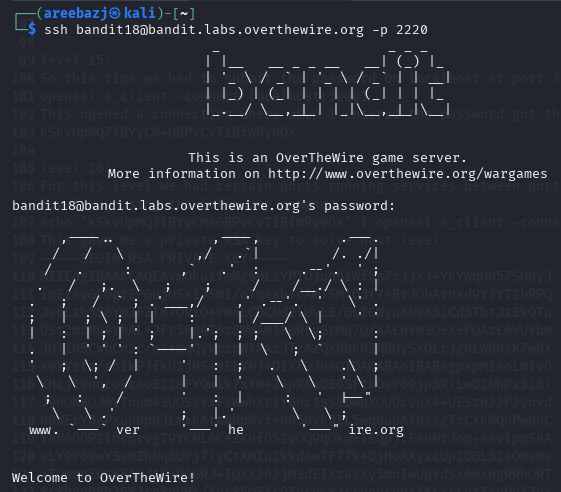

# BANDIT LEVEL 17 -> 18

## GOAL:

- There are 2 files in the homedirectory: passwords.old and passwords.new. The password for the next level is in passwords.new and is the only line that has been changed between passwords.old and passwords.new
- host => bandit.labs.overthewire.org
- port => 2220
- username => bandit18

## SOLUTION:

To start off we will view the contents of the directory:

Here we have to files and there in only one line different in them to find that we can utilize and amazing command called **diff**.
To see how to use it we will head over to the man page.

Since, we only want the unique lines in output we will use the `--normal` flag to achieve that outcome.

Here is the final command that we will use.

`diff <file_1> <file_2> --normal`

`diff passwords.new passwords.old --normal`

Above is our required key.

To login we have to use SSH . Following is a basic syntax of the command which we will use.

`ssh -p <port_number> <username>@<host>`

`ssh -p 2220 bandit18@bandit.labs.overthewire.org`

Here it shows connection closed and acc to the level description it was expected.

