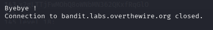
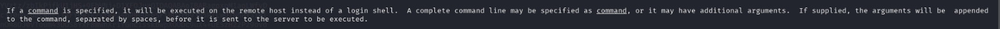
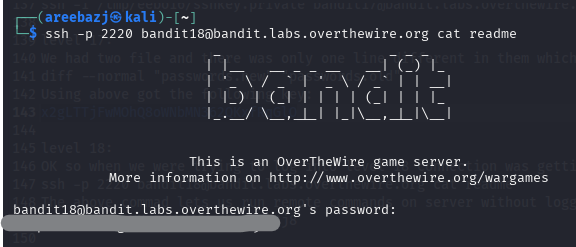
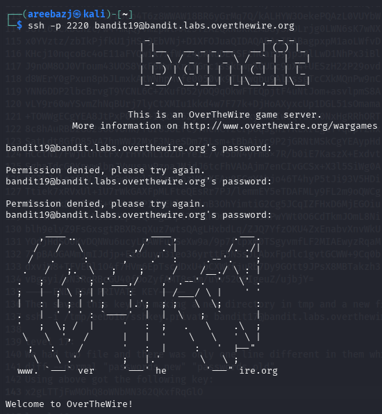

# BANDIT LEVEL 18 -> 19

## GOAL:

- The password for the next level is stored in a file readme in the homedirectory. Unfortunately, someone has modified .bashrc to log you out when you log in with SSH.
- host => bandit.labs.overthewire.org
- port => 2220
- username => bandit19

## SOLUTION:

When we were trying to connect to this level using SSH it kept closing the connection.

We now that the password is in a readme file so we need to execute the following command as soon as we connect:

`cat readme`

but the problem is that the connection resets before we can even do that. So we will head over to the man page of `ssh` to see if we can find any way to do this.

Here we saw that we can write the command we wanna execute right after our standard ssh connection command to execute it. Here is our final command that we ran to achieve that:

`ssh -p <port_number> <username>@<host> [command]`

`ssh -p 2220 bandit18@bandit.labs.overthewire.org cat readme`

As expected the command got executed and we got the password for the next level . Now we will just use the following command to login.

`ssh -p 2220 bandit19@bandit.labs.overthewire.org`

