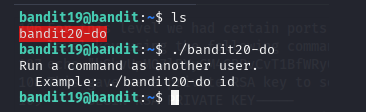
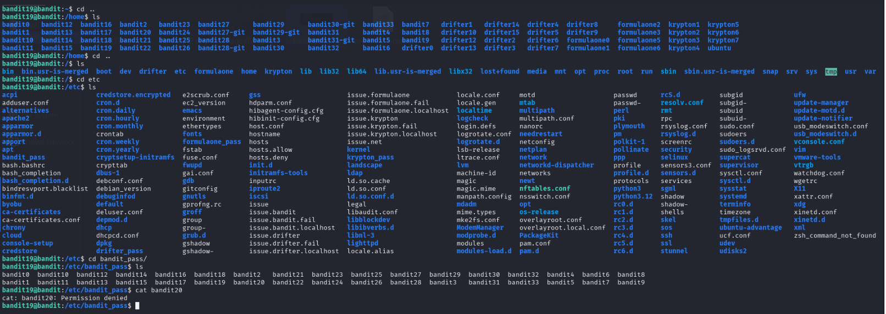
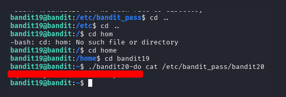
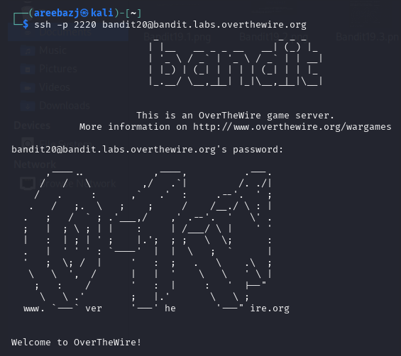

# BANDIT LEVEL 19 -> 20

## GOAL:

- To gain access to the next level, you should use the setuid binary in the homedirectory. Execute it without arguments to find out how to use it. The password for this level can be found in the usual place (/etc/bandit_pass), after you have used the setuid binary.
- host => bandit.labs.overthewire.org
- port => 2220
- username => bandit20

## SOLUTION:

According to the description we have a setuid binary in the current directory . Here is a little description of what it is:

A setuid binary is a program that runs with the permissions of its file owner, not the user who executes it. It typically used to grant temporary elevated privileges.

To run the binary we have to use `./` before it .As, we ran the binary it gave us the format how to use it.

Now we know that we can write any command and it will be executed as bandit20. 

Our ultimate goal is to obtain the password for bandit20 and we also know that password for each level is stored in the directory **/etc/bandit_pass/** and these files can only be viewed by that specific user.

Now we will navigate the file system to find the exact file we need to run
  

Here it is **/etc/bandit_pass/bandit20**. as we don't have permissions we can't view it's contents.

Following is a command that shows how we utilized the setuid binary to view the content of this file.

`./bandit-do cat /etc/bandit_pass/bandit20`

Here we got our password which we will use to advance to the next level.

To login we have to use SSH . Following is a basic syntax of the command which we will use.

`ssh -p <port_number> <username>@<host>`

`ssh -p 2220 bandit20@bandit.labs.overthewire.org`

