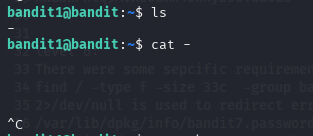
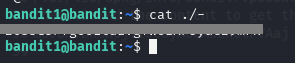
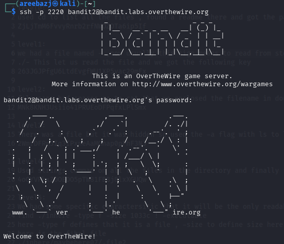

# BANDIT LEVEL 1 -> 2

## GOAL:

- Password for the level is in a file named "-" located in the home directory
- host => bandit.labs.overthewire.org
- port => 2220
- username => bandit2

## SOLUTION:

Use the following command to list all the files and directories .

`ls`

Here we can see a file named - , we used the following command to see it's content.

`cat <filename>`

`cat - `

But the above command won't give us the correct output as the file is named - and usually this sign means to read from stdin so to explicitly tell the command line to intrepret it as a file name we used the following command.

`cat ./-`

Here we got the password, this password will be used further when we login to bandit2.

To login we have to use SSH . Following is a basic syntax of the command which we will use.

`ssh -p <port_number> <username>@<host>`

`ssh -p 2220 bandit2@bandit.labs.overthewire.org`

