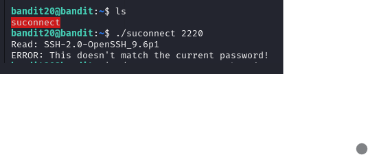
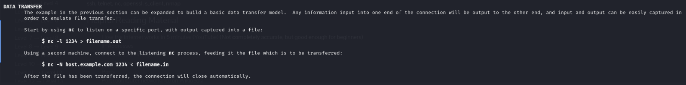
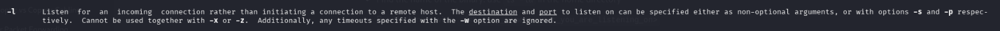
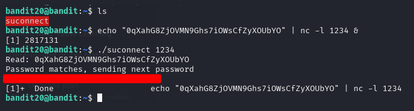
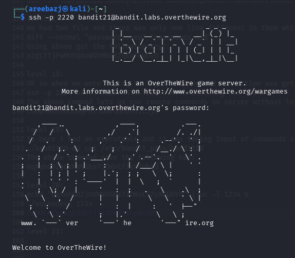

# BANDIT LEVEL 20 -> 21

## GOAL:

- There is a setuid binary in the homedirectory that does the following: 
     - it makes a connection to localhost on the port you specify as a commandline argument. 
     - It then reads a line of text from the connection and compares it to the password in the previous level (bandit20). 
     - If the password is correct, it will transmit the password for the next level (bandit21).

- NOTE: Try connecting to your own network daemon to see if it works as you think
- host => bandit.labs.overthewire.org
- port => 2220
- username => bandit21

## SOLUTION:

First we will view the contents and run the file with a sample port just to have an idea of what to expect in the output.

Since the above will make a connection to the specified port we have to setup a listener on that port so that when this try to make a connection we will be notified and can input our current level's password.

Now we can do two things:

1- Either set up a listener then execute binary and wait of it to make connection then input the password.

2- Or just pipe the password with the command where we setup the listener so that we don't have to manually enter it.

To setup a listener we visited the man page of **nc** command and got a following example.

We will use the second method and the following command to setup the listener and then run the binary.

`echo <password> | nc -l <port_number> &`

`echo <password> | nc -l 1234 &`

`./suconnect 1234`

here **&** is used to background the process so that we can use the same terminal to execute the binary and the listener works in the background.

Here we got our password which we will use to advance to the next level.

To login we have to use SSH . Following is a basic syntax of the command which we will use.

`ssh -p <port_number> <username>@<host>`

`ssh -p 2220 bandit20@bandit.labs.overthewire.org`

