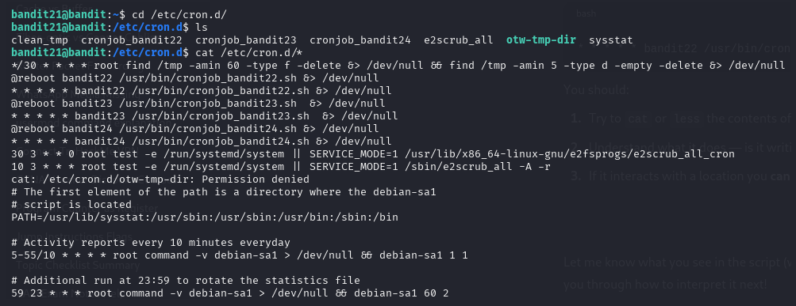
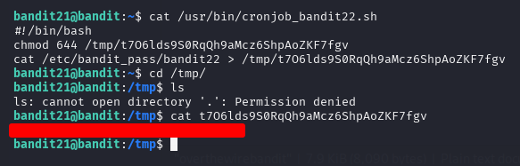
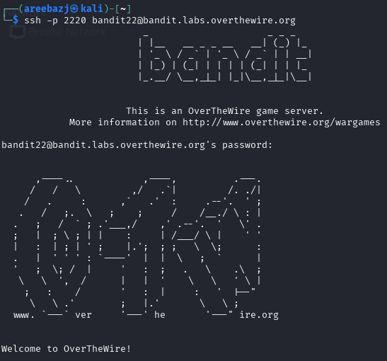

# BANDIT LEVEL 21 -> 22

## GOAL:

- A program is running automatically at regular intervals from cron, the time-based job scheduler. Look in /etc/cron.d/ for the configuration and see what command is being executed.
- host => bandit.labs.overthewire.org
- port => 2220
- username => bandit22

## SOLUTION:

First we went to the **/etc/cron.d/** directory to look for all the cron jobs present there. Then we used the following command to view tha contents of all of them at once.

`cat /etc/cron.d/*`

Here we found a cronjob that felt a little relevant named **cronjob_bandit22** . Then we used `cat` to view it's contents.

The script showed that it is copying the contents of **/etc/bandit_pass/bandit22** in a file in **tmp** directory and this file is given read access for all users and groups too. So that means we are allowed to see it's contents and we also know that **bandit_pass** contains passwords for each level so that means we can easily obtain the password for level 22 by reading that file in **tmp**.

Here we got our password which we will use to advance to the next level.

To login we have to use SSH . Following is a basic syntax of the command which we will use.

`ssh -p <port_number> <username>@<host>`

`ssh -p 2220 bandit22@bandit.labs.overthewire.org`

