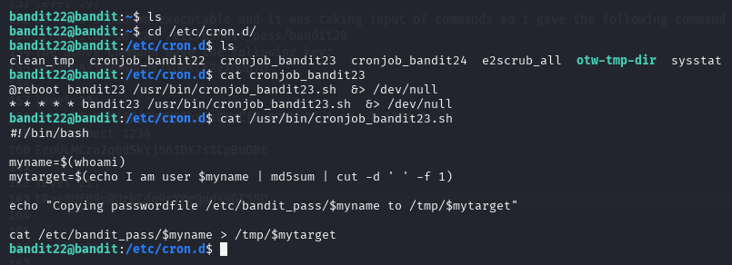
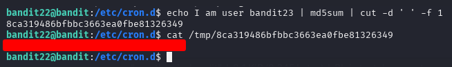
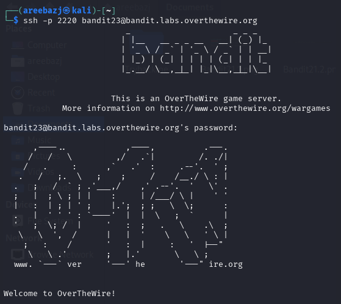

# BANDIT LEVEL 21 -> 22

## GOAL:

- A program is running automatically at regular intervals from cron, the time-based job scheduler. Look in /etc/cron.d/ for the configuration and see what command is being executed.
- host => bandit.labs.overthewire.org
- port => 2220
- username => bandit23

## SOLUTION:

First we went to the **/etc/cron.d/** directory to look for all the cron jobs present there.

`cat /etc/cron.d/`

Here we found a cronjob that felt a little relevant named **cronjob_bandit23** . Then we used `cat` to view it's contents.

Here we can see there is a script running which we will now try to understand.

- First there is a variable named **myname** and it is storing the output of the command `whoami`. Now we know this script is running as user bandit23 so when that user will run this command it will show **bandit23** in the output. 

- Now we have an another variable named **mytarget** which is storing the output of the following command:

    `echo I am user $myname | md5sum | cut -d ' ' -f 1`

    This script means that first it will print the following statement

    **I am user bandit23**

    Then calculate the md5 hash of it.By default md5 appends a hyphen (-) at the end to remove . The script is using **cut** command with `-d` flag to mention the delimitter i.e. space then a `-f` flag to mention that it has to be cut to the field of 1.

- At the end this script will copy the contents of **/etc/bandit_pass/bandit23/** that has the password for bandit23 in a file named after the variable **mytarget**

To find the filename we will simply run the above the same command i.e.

`echo I am user bandit23 | md5sum | cut -d ' ' -f 1 `

Then we will the switch the file in **tmp** directory which matches this output.

Here we got our password which we will use to advance to the next level.

To login we have to use SSH . Following is a basic syntax of the command which we will use.

`ssh -p <port_number> <username>@<host>`

`ssh -p 2220 bandit22@bandit.labs.overthewire.org`

