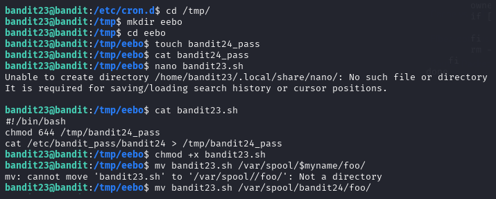

# BANDIT LEVEL 23 -> 24

## GOAL:

- A program is running automatically at regular intervals from cron, the time-based job scheduler. Look in /etc/cron.d/ for the configuration and see what command is being executed.
- host => bandit.labs.overthewire.org
- port => 2220
- username => bandit24

## SOLUTION:

First we went to the **/etc/cron.d/** directory to look for all the cron jobs present there.

`cat /etc/cron.d/`

Here we found a cronjob that felt a little relevant named **cronjob_bandit24** . Then we used `cat` to view it's contents.

Here we can see there is a script running which we will now try to understand.

- First there is a variable named myname that is storing the output of the command `whoami` as this script is run as the user bandit24 so the output of this command will be bandit24.

- Then we will use `cd` to go to a directory named `/var/spool/bandit24/foo/`

- Here the keyword for is being used to loop through the files in the directory `*` is used for all normal files and `.*` for all hidden files.

- Then here is an if condition that checks that the current file name is not equal to `.` and `..` here , both of these are navigation shortcuts `.` for the current directory and `..` for parent directory.

- After this a simple message will be printed with the filename being handled.

- In the next line we have a variable named **owner** and it is being assigned a value dynamically through a command as follows:
`stat --format '%U' ./$i`
Here is a breakdown of the above command:
    - The command `stat` is used to list details about a file like owner,user,permissions etc.
    - the `--format` keyword is used to specify a special format for the answer here `"%U"` refers to owner .
    - Lastly, `./$i` this is used to specify the current file.

- After that an if condition will check if the owner is `bandit23` and based on that it will run the file.

- The file will be run with a timelimit by using the keyword `timeout` the `-s` is used to specify the signal to send `9` this refers to a signal called `SIGKILL` which forcefully stops a process. `60` This refers to the time duration in secs.

- After that whatever the file is it is deleted using the `rm` command .

After reading the script we found a solution we thought of making a script that can read the password of `bandit24`. Now we will switch to directory `/etc/tmp/` where we have creation rights. Then we will create a new directory and in that create a new file where we want our new password to be stored.

Then we will use the following script:

`#!/bin/bash`

`chmod 644 /tmp/bandit24_pass`

`cat /etc/bandit_pass/bandit24 > /tmp/bandit24_pass`

The above script will read the password of bandit24 from bandit_pass then pass this into the file we newly created also provided adequate permissions to it so that we can view.

Now we will make this script executable using:

`chmod +x <file_name>`

Finally we will move this script to the  `/var/spool/bandit24/foo/` directory and wait for atleast a min so that the script can be executed .

After a min we read the contents of our file and got our password which we will use to advance to the next level.

To login we have to use SSH . Following is a basic syntax of the command which we will use.

`ssh -p <port_number> <username>@<host>`

`ssh -p 2220 bandit24@bandit.labs.overthewire.org`

