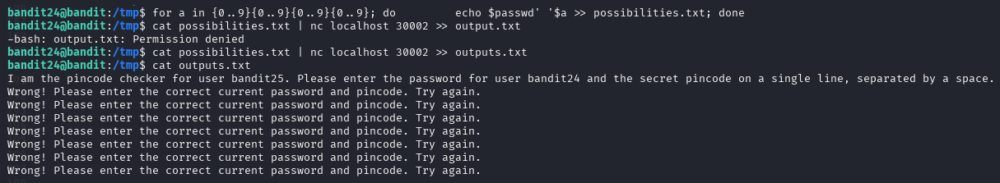
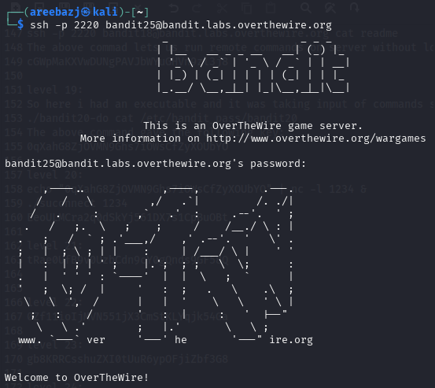

# BANDIT LEVEL 24 -> 25

## GOAL:

- A daemon is listening on port 30002 and will give you the password for bandit25 if given the password for bandit24 and a secret numeric 4-digit pincode. There is no way to retrieve the pincode except by going through all of the 10000 combinations, called brute-forcing.
You do not need to create new connections each time
- host => bandit.labs.overthewire.org
- port => 2220
- username => bandit25

## SOLUTION:

At first we will print all possibilities of the secret numeric pincode through a script and save them in a file using the following script:

`for a in {0..9}{0..9}{0..9}{0..9}; do echo $passwd''$a >>possibilities.txt; done`

Then we will read each line from this file and send the output to the `nc` command that is connecting to the localhost at port 30002 as input and save the response given by the server in a file named output.txt.

`cat possibilities.txt | nc localhost 30002 >> outputs.txt`

After that we will just view the contents fo the file to find the pincode.

Here we got our password which we will use to advance to the next level.

To login we have to use SSH . Following is a basic syntax of the command which we will use.

`ssh -p <port_number> <username>@<host>`

`ssh -p 2220 bandit25@bandit.labs.overthewire.org`

