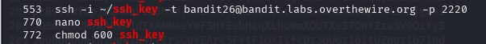
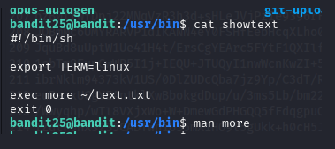

# BANDIT LEVEL 25 -> 26

## GOAL:

- Logging in to bandit26 from bandit25 should be fairly easy… The shell for user bandit26 is not /bin/bash, but something else. Find out what it is, how it works and how to break out of it.
- host => bandit.labs.overthewire.org
- port => 2220
- username => bandit24

## SOLUTION:

We found a ssh key for bandit level 26 in the current directory . 

We will use this key to login to bandit level 26.We will use the following command to login to bandit26 through bandit25.

`ssh -i ~/bandit26.sshkey -t bandit26@bandit.labs.overthewire.org -p 2220`

Here I copied the key in a new file in my local pc and then gave that file strict permissions so that only owner can read and write. The reason for these strict permissions is that the file contains a private key that is a confidential thing and we can not allow such loose permissions. Following snapshot shows the commands I used for this purpose.

As we logged in to bandit 26 we saw this text appear and then our connection was closed.

As we were already told in the challenge description It is a special type of shell so, in bandit25 we will try to view what kind of shell the user has for that we will view a file called  **/etc/passwd** . This is a special type of file that stores the user information. Following is an overview of what it tells.

`username:password:UID:GID:comment:home_directory:shell`

As we can see bandit26 uses a custom shell i.e. **/usr/bin/showtext** . Now we will try to see the content of it.

Let's try to understand this.

- `#!/bin/sh`

This tells Linux to run the file using the sh shell (like a lightweight version of bash).

- `export TERM=linux`

This sets the terminal type to linux so that the **more** command works properly (makes text display correctly).

- `exec more ~/text.txt`

This runs the more command to show the contents of text.txt.
Because of exec, we can’t go back to a normal shell and we are stuck inside more.

- `exit 0`

This just says "exit successfully", but it’s never used because exec already takes over.

Now we will try to escape from it . We can see more is used here to read the program.

**more** is a pager program used to view long text files page by page. It will only print the that much info that can fit in the current terminal window then provide an option to move ahead(to the next page) through `c` or quit using `q`.

The text in the **text.txt** file was so less that before we can get this option it can be printed in the current window size . So we will deliberately shorten our window's size .

Through the man page of more command we found out that by pressing `v` we can open a `vim` interface inside more and that is what we will do.

Our main purpose is to get the shell we know a trick that if we type `:shell` command in vim it will give us shell. Since, the users default shell is sh we need to change it for that we will use the following command `:set shell=/bin/bash`

Here we can see we got our shell . There is another way if we don't want shell but only wanto to execute a certain command we can use the `:e` inside vim.

In the above picture I used the following command to get that password displayed on the screen .

`:e /etc/bandit\_pass/bandit26`

