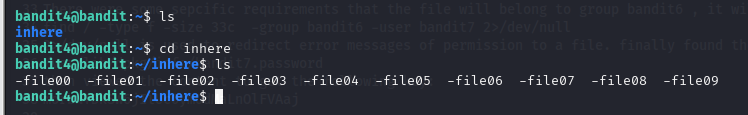
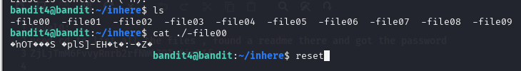
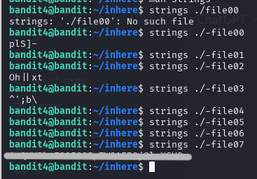
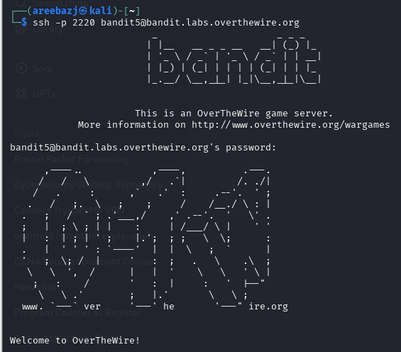

# BANDIT LEVEL 4 -> 5

## GOAL:

- The password for the next level is stored in the only human-readable file in the inhere directory. 
- host => bandit.labs.overthewire.org
- port => 2220
- username => bandit5

## SOLUTION:

Use the following command to list all the files and directories .

`ls`

Then to go to the directory inhere using the following command:

`cd <directory_name>`

`cd inhere` 

now again list the files in this directory using ls

Here we can see that the content of the first file is not in a readable format , also the output messed up our terminal which we corrected using the reset command

`cat ./-file00`

`reset`

Now here we can use a command called strings, what is does is that it retrieves all the human readable strings from a certain(quite consistent with what we want).Following is it's syntax

`strings <file_name>`

So, here we will use this command for all files since, there were few files we used a manual way or else we would've used for a script.

Here we got the password, this password will be used further when we login to bandit5.

To login we have to use SSH . Following is a basic syntax of the command which we will use.

`ssh -p <port_number> <username>@<host>`

`ssh -p 2220 bandit5@bandit.labs.overthewire.org`

