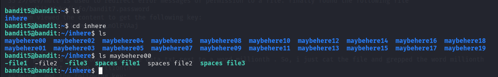
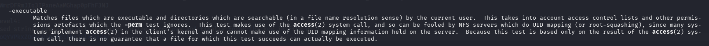
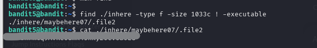

# BANDIT LEVEL 5 -> 6

## GOAL:

- The password for the next level is stored in a file somewhere under the inhere directory and has all of the following properties:

    - human-readable
    - 1033 bytes in size
    - not executable

- host => bandit.labs.overthewire.org
- port => 2220
- username => bandit6

## SOLUTION:

Use the following command to list all the files and directories .

`ls`

Then to go to the directory inhere using the following command:

`cd <directory_name>`

`cd inhere` 

now again list the files in this directory using ls

Through this found out that there we too many directories in the folder inhere and too many files in each directory that it would be extremely hard to search if each file met the specific characteristics

Here comes a command called 'find' . It is used to search for files meeting a specific criteria in a directory. We will use it to search for files within the inhere directory. Following is it's syntax:

`find <directory_name> <options> <expressions>`

Now to tailor this command to our need  we will explore it's man page to find relevant flags.

`man find`

1- So the first condition was that it should be a human readable file so we found a following flag that was a bit relevant 

`-type f`
 
 type flag with f to specify that it is a file

2- The second condition was that the file should be 1033 bytes in size for which following is a relevant flag.

`-size 1033c`

size flag with c suffix to determine that the size is in bytes.

3- The third condition was that it should not be an executable for which following is a good match:

`! -executable` 

executable flag with ! (not operator) to negate the flag

Here is the final combined command that we used and got teh file . Later we saw it's content and got the password.

`find ./inhere -type f -size 1033c ! -executable`

To login we have to use SSH . Following is a basic syntax of the command which we will use.

`ssh -p <port_number> <username>@<host>`

`ssh -p 2220 bandit6@bandit.labs.overthewire.org`

