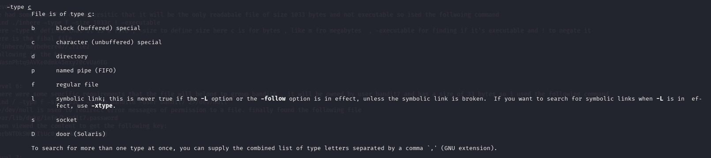
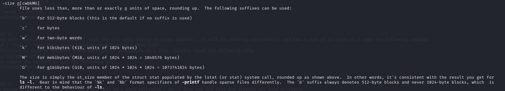
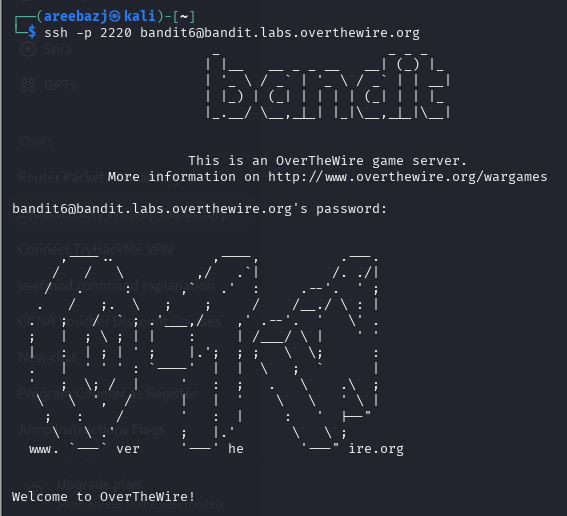

# BANDIT LEVEL 6 -> 7

## GOAL:

- The password for the next level is stored somewhere on the server and has all of the following properties:

    - owned by user bandit7
    - owned by group bandit6
    - 33 bytes in size

- host => bandit.labs.overthewire.org
- port => 2220
- username => bandit7

## SOLUTION:

The password is in a file that can be anywhere on the server now, it is extremely unfeasible to search in every location for a file that meets the given requirements.

Here comes a command to the rescue called 'find' . It is used to search for files meeting a specific criteria in a directory. We will use it to search for files in the whole server. Following is it's syntax:

`find <directory_name> <options> <expressions>`

Now to tailor this command to our need  we will explore it's man page to find relevant flags.

`man find`

1- So the first condition was that it should be a file so we found a following flag that was a bit relevant 

`-type f`
 
 type flag with f to specify that it is a file

2- The second condition is that the file should be owned by user bandit7 which can be filtered using following flag 

`-user bandit7`

user flag with bandit7 as the specific user

3- The third condition is that the file should be owned by group bandit6 which can be filtered using following flag 

`-group bandit6`

group flag with bandit6 as the specific group

4- The fourth condition was that the file should be 33 bytes in size for which following is a relevant flag.

`-size 33c`

size flag with c suffix to determine that the size is in bytes.

Here is the final combined command that we used and got the file . Later we saw it's content and got the password.

`find / -type f -size 33c  -group bandit6 -user bandit7 2>/dev/null`

Here we used / to search everywhere

One thing that might be confusing would be the `2>/dev/null` command so actually when we are searching everywhere on the server we will come across alot of places where we won't have the access which will generate error messages causing alot of irrelevant messages to display on the screen so to discard them we use the above command here is a breakdown of what it does:

- 2 refers to file descriptor 2, which is stderr (standard error).
- `>` This is the redirection operator. It redirects output to a file or location.
- `/dev/null` This is a special device file that discards anything written to it. 

To login we have to use SSH . Following is a basic syntax of the command which we will use.

`ssh -p <port_number> <username>@<host>`

`ssh -p 2220 bandit4@bandit.labs.overthewire.org`

