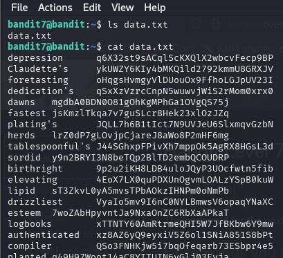
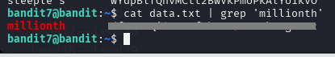
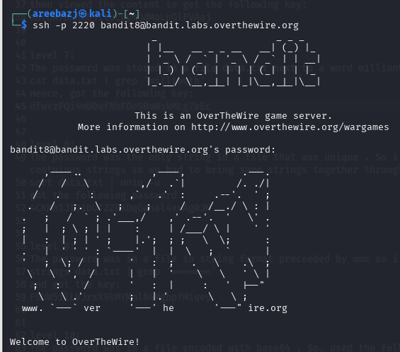

# BANDIT LEVEL 7 -> 8

## GOAL:

- The password for the next level is stored in the file data.txt next to the word millionth
- host => bandit.labs.overthewire.org
- port => 2220
- username => bandit8

## SOLUTION:

We know that the password is in a file named data.txt next to the word millionth. We will first list the files and see the contents of data.txt using following commands.

`ls`

`cat data.txt`

It can be seen that the above file has alot of data and it is not efficient to go through every single line to find the specific password.

Here we can utilize a very useful command called 'grep'. It is used to search for a specific text or pattern in a file or input.Following is it's basic syntax:

`grep <options> <pattern> <file_name>`

since, the password in next to the word millionth we will use the following commnad:

`cat data.txt | grep 'millionth'`

Here I used the command in a different way and used a special operator '|' called 'pipe operator' . It passes the output of one command as input to another command So, I printed the data of the file using grep and then passed it as an input to grep and got the following result along with the password.

To login we have to use SSH . Following is a basic syntax of the command which we will use.

`ssh -p <port_number> <username>@<host>`

`ssh -p 2220 bandit8@bandit.labs.overthewire.org`

