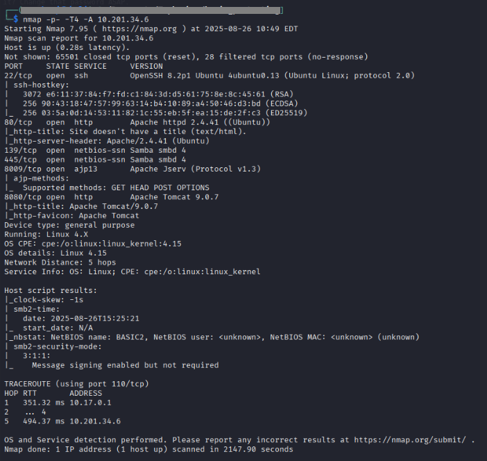
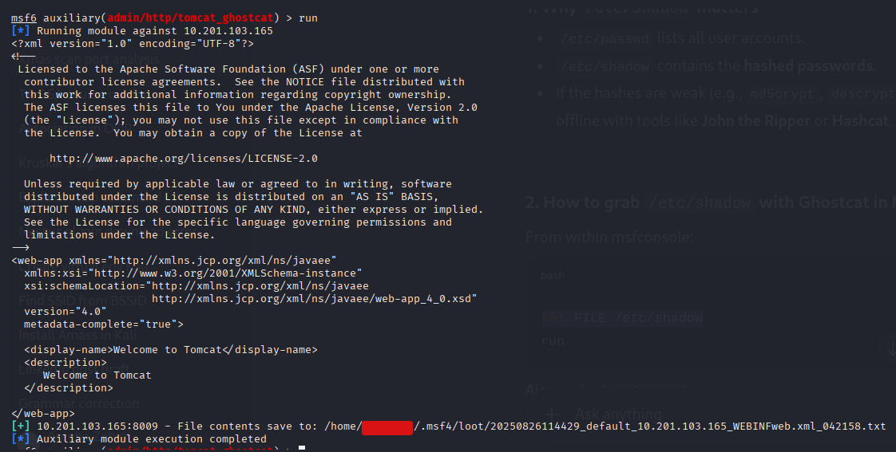
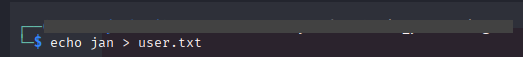

#   Basic Pentesting

**Room URL:** [Basic Pentesting](https://tryhackme.com/room/basicpentestingjt)  
**Difficulty:** Easy   
**Author:** Areeba Zehra Jafri        
**Date Completed:** 9-July-2025

## Room Overview

To solve this room we have to use following techniques:

- brute forcing 

- hash cracking 

- service enumeration

- Linux Enumeration

## Solution Walkthrough

### 1- Deploy the machine and connect to our network

I used openvpn to connect to the network and then deployed the machine.

### 2- Find the services exposed by the machine

To find the answer of this question I did an nmap scan on the given IP using following command.

`nmap -T4 <machine_ip>`

This command gave us the following output .

There were alot of services but before diving deep in any of them I looked at the next question which is given below.

### 3- What is the name of the hidden directory on the web server(enter name without /)?

I visited the web page at port 80 but there wasn't anything interesting.

Then I opened the page source and saw the following comment.

Now we have to do directory brute forcing, for that I used OWASP dirbuster. It has a nice GUI interface you can also use some CLI tools like dirb or gobuster. 

Here I set the url to our target , then selected a wordlist . There were alot of wordlists already in my kali linux's dirbuster folder so I used a small one from that. I kept all the other things default. 

In just few seconds it gave me a directory called **development** that looked interesting . I kept the scan going on and visited this directory.

Here I find the following 2 files So , most probably this was the directory that we were looking for . I stopped my scan that was running in the background. Here is what the content of each file was:

Here we can see a coversation between 2 poeple J and K . From the conversation it seems like Apache struts and SMB are the 2 services that might be of some interest to us. They have also mentioned the version explicitly.

The next conversation shows that user J might have some weak credentials.

At this point we have some suspicious services so to know a little more about them I tried the following nmap command.

`nmap -p- -T4 -A <machine_ip>`

It gave us detailed info about each service.

From here I got on a wrong track . Feel free to skip this part and jump to part 4. 

I saw that apache tomcat 9.0.7 was running on port 8080 . I searched for it on the internet and found that it had a vulnerability. 

Then I also got a bit info about this from Rapid7.

I searched for it on msfconsole and found 2 things an exploit and an auxiliary module.

In my mind I was thinking of maybe we can read etc/shadow in some way as it had some weak creds . I ended up using this but after running it wasn't successful.

### 4- User brute-forcing to find the username & password

From here I got back on track . Since SMB was running I used smbclient to access and list down all the SMB shares . 

`smbclient -L //IP/ -N`

here I used -N so that it will list all shares where anonymous access (access without password) is allowed.

Here I found a share named `Anonymous` and accessed it using the following command:

`smbclient //IP/Anonymous -N`

The above command listed all the commands I can use .I used the `l` command to list all the files and found a file named **staff.txt** then downloaded it using the `get <file_name>` command.

### 5- What is the username?

Here we had names of two users in the file and the one related to -J was correct.

I also tried another way for finding out the users by using enum4linux . Enum4linux is a tool for enumerating information from Windows and Samba systems. I used the following command to start enumeration.

`enum4linux -a <machine_ip>`

here I used the -a flag so that it can run all the options without me telling each flag seperately for users,shares etc.

We can see in the above image that we again found both those users.

### 6- What is the password?

Now, we have to find the password . For this I used a tool called hydra. It is a fast, popular password-cracking tool used in cybersecurity. It carries out brute force or dictionary based attacks against passwords.

For users we had two Jan and Kay so we can either put both of them in a file and use that file as a list of users whose password we have to crack.

Or just try one by one. I first tried to break Jan's password , for that I used the following command:

`hydra -l jan -P /usr/share/wordlists/rockyou.txt <machine_ip> ssh`

here `-l` is for username `-P` is for list of possible password i.e. wordlist. Here I used rockyou.txt which is a popular wordlist usually used in CTFs. ssh at the end is for defining that we are searching for passwords for SSH service.

After just a little while we got our password.

### 7- What service do you use to access the server(answer in abbreviation in all caps)?

we used the same service for which we searched the password for and used both username and password to login and we were successful.

### 8- Enumerate the machine to find any vectors for privilege escalation

After going through the files I found a file pass.bk in the folder of another user Kay but it was owned by that user then, I also found a private ssh key for that user too.

### 9- What is the name of the other user you found(all lower case)?

It's so obvious at this point, we found it the same time we found our first user.

### 10- If you have found another user, what can you do with this information?

Since, now we have the private key of the second user we can try logging in through his account using ssh.

Then on my local pc I saved that key in a file named **id_rsa** . Then I changed the permissions to 600 which is necessary for RSA key files. Then I used john the ripper to crack this key and find password from it , for this I used the following commands.

Now i used the following command to log in through SSH and used the private key file to log in.

`ssh -i id_rsa kay@<machine_ip>`

Then entered the password and got access.

### 11- What is the final password you obtain?

Now we were able to access the pass.bak file and got the password.

So, just like that we have now completed our room.

## Tools Used

Following are some tools that I used in solving this room.

1- [Dirbuster](https://www.kali.org/tools/dirbuster/)                 
2- [Nmap](https://nmap.org/)                  
3- [enum4linux](https://www.kali.org/tools/enum4linux/)      
4- [smbclient](https://www.samba.org/samba/docs/current/man-html/smbclient.1.html)         
5- [John the Ripper](https://www.openwall.com/john/)

