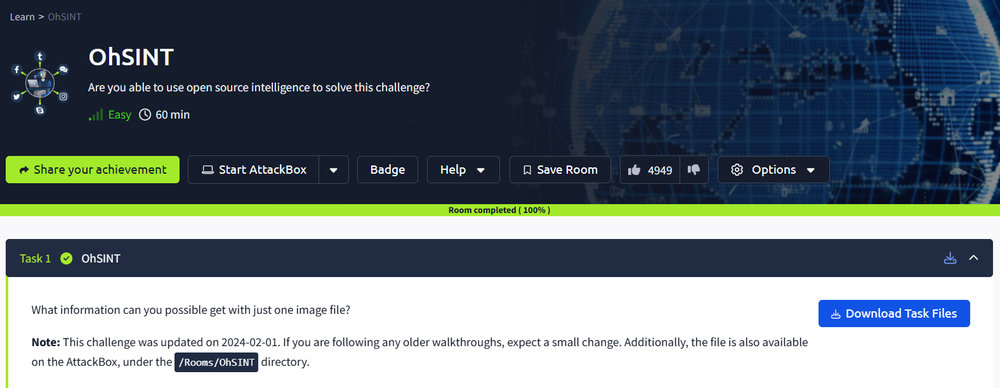
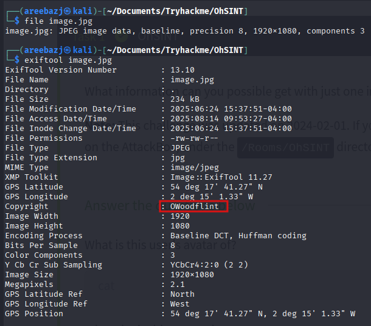
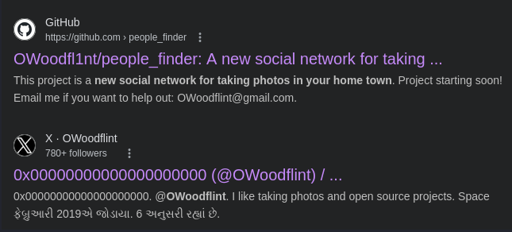
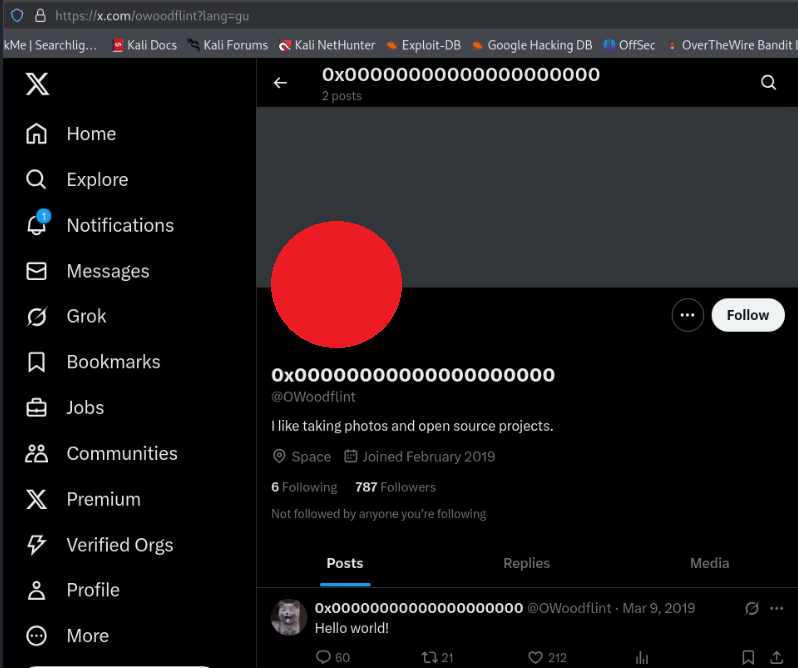
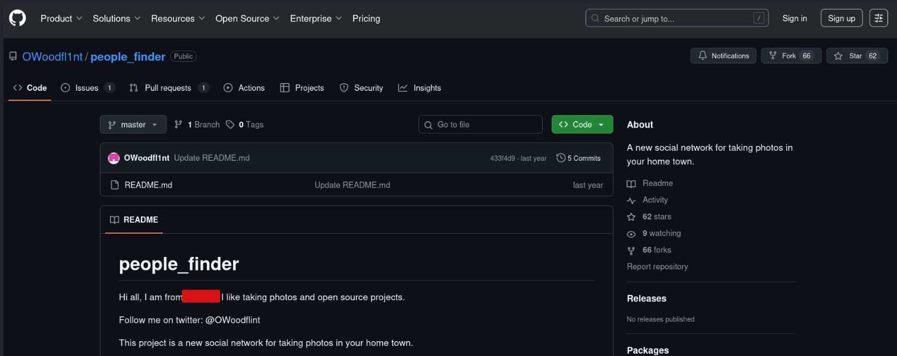
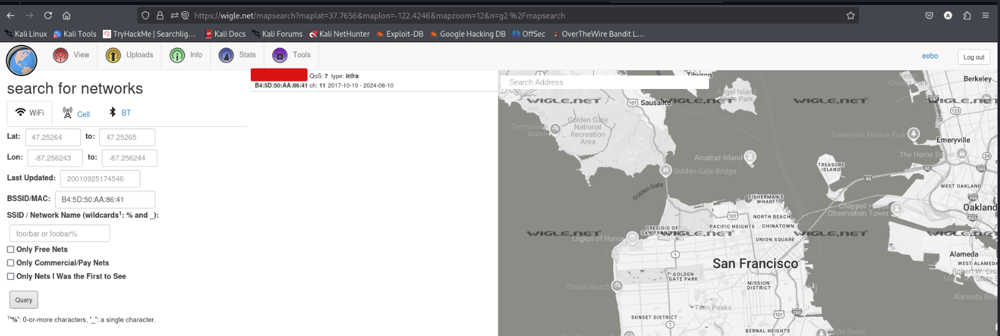
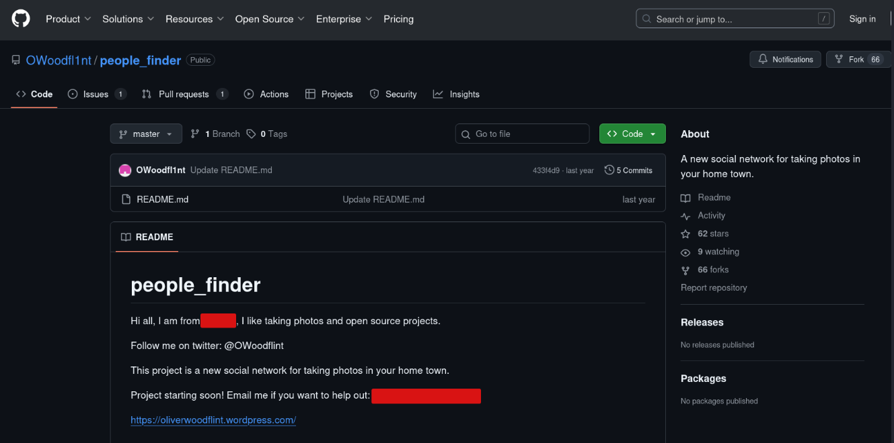
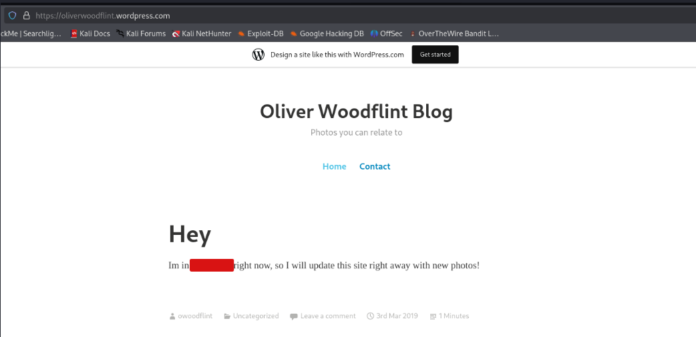
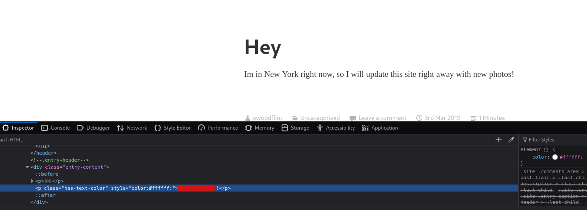
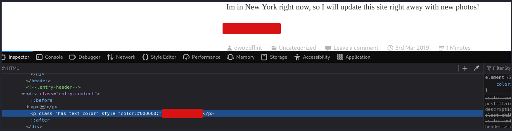

#   OhSINT

**Room URL:** [OhSINT](https://tryhackme.com/room/ohsint)  
**Difficulty:** Easy   
**Author:** Areeba Zehra Jafri        
**Date Completed:** 1-July-2025

## Room Overview

## Solution Walkthrough

First of all I downloaded the task file . It was an image.The image wasn't anything unique just a Windows XP wallpaper. Before digging in deep I saw the first question which is given below.

### 1- What is this user's avatar of?

The question is talking about a user and most probably it can be the image owner or something . Moving forward I used the following command to confirm the format of the image:

`file image.jpg`

This confirmed that the file was definitely a JPEG . To dig deep I utilized a tool called **exiftool** . I will use this tool to look at the meta data of the file.

`exiftool image.jpg`
 
 The command gave us the following results.

Here we can see that the copyrights of the image belongs to a person named **OWoodflint** . A quick search about him on google gave us the following results.

After opening the twitter account I saw the profile pics gave it as answer and it was correct.

Here I saw another interesting thing that was a BSSID but let's put in on side for a bit.

### 2- What city is this person in?

This was the next question. Scrolling through twitter didn't gave me the answer so I decided to switch to GitHub and got the answer .

We can see there is also an email address here and a wordpress site let's also note these and move on.

### 3- What is the SSID of the WAP he connected to?

Remember the BSSID we saw on twitter, I searched for some tools online and got one that can tell us the SSID through a BSSID . The tool is called **wiGLE** . A quick search on wiggle gave me the desired SSID.

### 4- What is his personal email address?

I entered the same email address I found on GitHub and it was correct.

### 5- What site did you find his email address on?

At this point, I guess we all know the answer.

### 6- Where has he gone on holiday?

I looked through the twitter and github but didn't found anything else . So, then I decided to visit that wordpress site and there was our answer right infront of us.

### 7- What is the person's password?

My first thought was to look at the previous commits on the GitHib repo but after searching for a while didn't found much there . Now I have already searched twitter so now I decided to look at the webiste. Tried to see the source code through `CTRL+U` but there was a lot of code . In the end I opened the inspector and while hovering on different sections I found a section where there was something written in the code but not visible as it was in white .

This was the password and by this we got this answer correct . I also tried changing the colour of that text and then It appeared on the site.

So, just like that we have now completed our room.

## Tools Used

Following are some tools that I used in solving this room.

1- [exiftool](https://exiftool.org/)                 
2- [wiGLE](https://wigle.net/)