#   Geolocating Images

**Room URL:** [Geolocating Images](https://tryhackme.com/room/geolocatingimages)  
**Difficulty:** Easy  
**Author:** Areeba Zehra Jafri        
**Date Completed:** 15-August-2025

## Room Overview

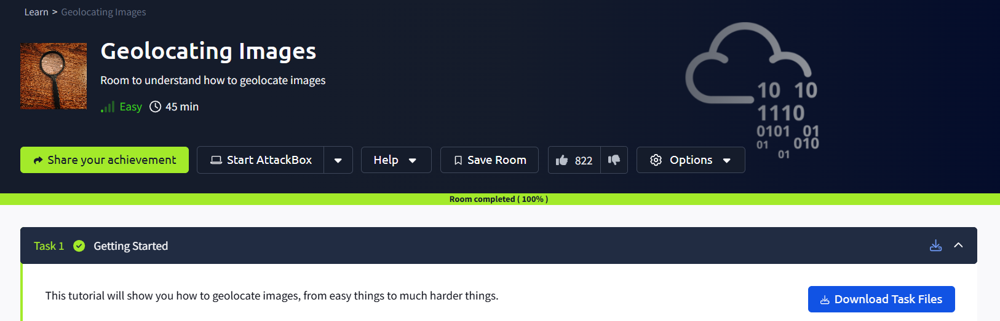

## Solution Walkthrough

To start of I first downloaded all the files they were in a zip folder. Then I unzipped them using the follwoing command and found out that there were total 4 images which we had to use in different parts of this room.

`unzip <folder_name>`

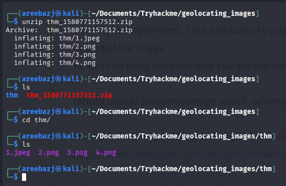

### Task 2 -> Getting our feet wet - where is this?

So, I am starting this writeup from task 2 as task one was just some reading based on reverse image search etc. . 

In the second task we have to carry out a reverse image search and as they have said in the task description that Google image search might not give the correct answer so, we have to try Yandex and then see the difference.

What we can do is we can just easily go to both Google and Yandex and just upload our image and notice the results but here I am going to suggest you an extension that is called **RevEye Reverse Image Search** (I have privided the link below). This is an amazing extension you can download it and whenever you right click on an image you can select the reverse image search option. Here you will get the option to select between multiple search engines like Google, Yandex, Bing etc. also there is an option for search by all that will use all search engines at once saving you alot of effort.

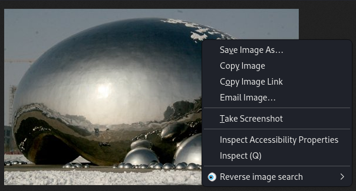

Above image shows how it looks like . So, I just selected both Google and Yandex from above. Now let's analyze the output.

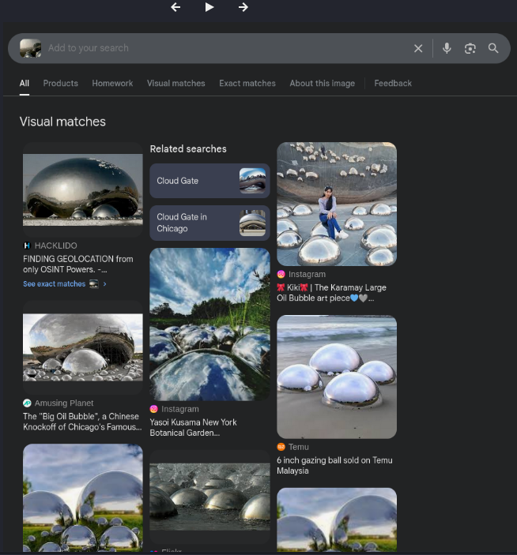

The above image shows the results of google search . As, you can see the search results are all over the place but most of them are hinting towards this place being in Chicago but this wasn't the right answer. Now let's look at Yandex.

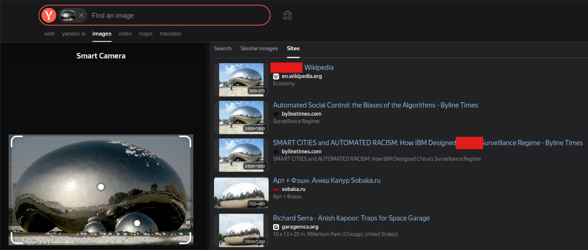

Yandex right away gave us the country and when I checked that was correct. Now let's move on to the next task.

### Task 4 -> Now your turn

Task 3 was also like a walkthrough and it gave some insights on how we can use popular landmarks and utilize google maps to find a location.

So, equipped with this information let's try our task 4 and see what we can find in image 2.

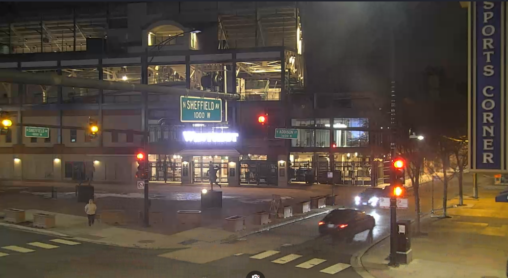

Looking at the image i identified three major things:

1- A sign board showing Sheffield Avenue

2- A sign board showing Addison Street

3- A board showing that there is something called a **sports corner** .

Combining some of the above things I simply tried searching for Sports Corner on Sheffield Avenue and got the follwoing location. 

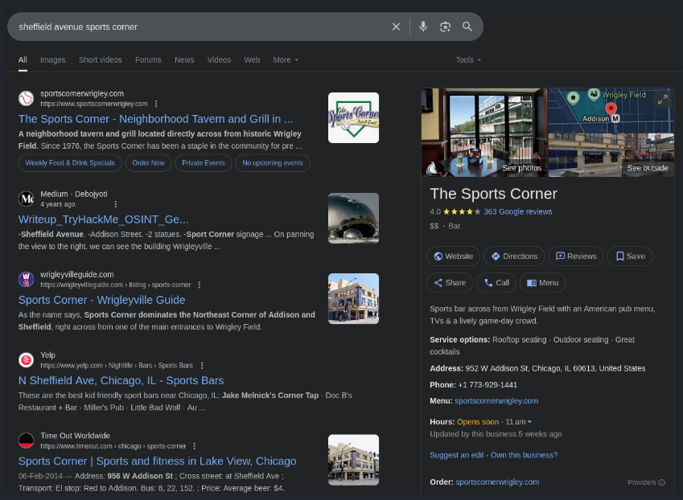

From the angle of the image we can see that the webcam is somewhere opposite of the sports corner so, I opened the location in street view and saw something relevant .

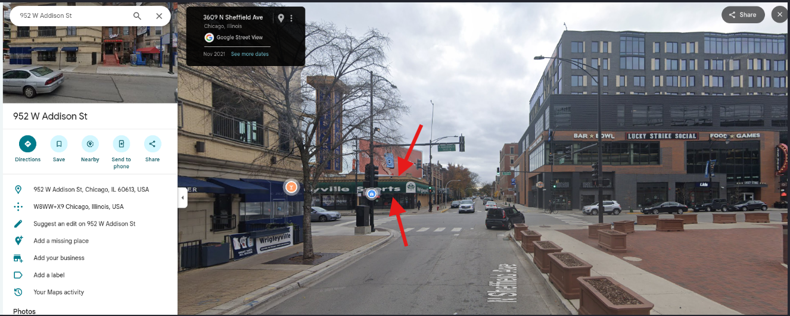

Moved ahead a bit and there it was, the location we were searching for. I submitted it and it was infact, the  correct answer.

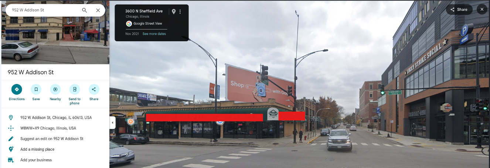

### Task 6 -> Your turn, again!

Now let's dive into task 6 skipping task 5 as it's for you to read on your own. 

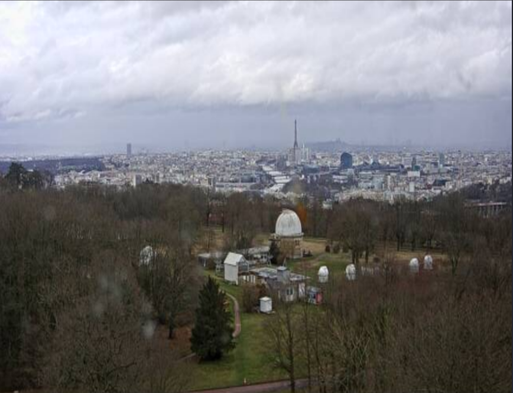

In this picture we have to tell the name of the place the webcam is facing. Immediately, I saw in the background a tall landmark that looks like an **Eiffel Tower** so that means this pic is of something in Paris . 

Looking at that white building infront, my first thought was maybe it's a Mosque or a Tomb but as you must have read in Task 5 we must look at things and think thar if they are likely to be in that city or country or not . 

So instead of going deep in that direction (I still tried searching for them but didn't find anything relevant) I tried searching for buildings and places that might have this kind of style and that's when I saw a word observatory.

This really looked relevant as we are talking about Paris and it must have alot of them . The task description also says that we will see a lot of similar results.

At first I just simply searched on gooogle and saw a photo that looked a bit similar and it was named as Paris observatory but there were so many places with the same name.

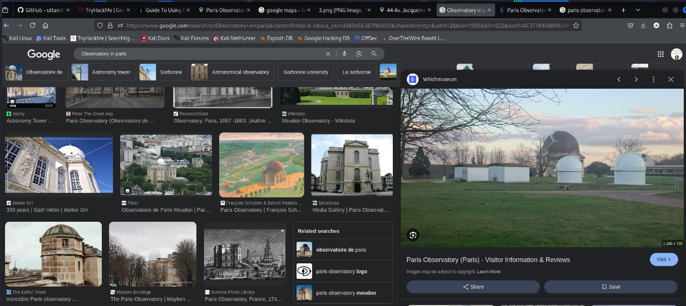

Then, on the google maps I searched for eiffel tower then chose the nearby option and searched for observatories. Sure enough there were alot of results. From here I started to look at those named Paris Observatory to just reduce the scope a little bit.

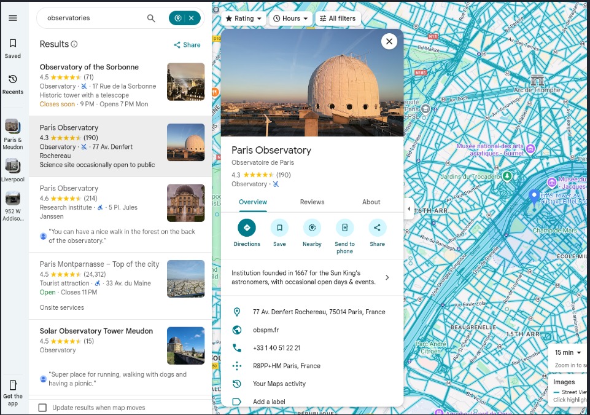

I tried looking at the above one on the map but couldn't find any other name for it and it also didn't match the image.So, I moved on.

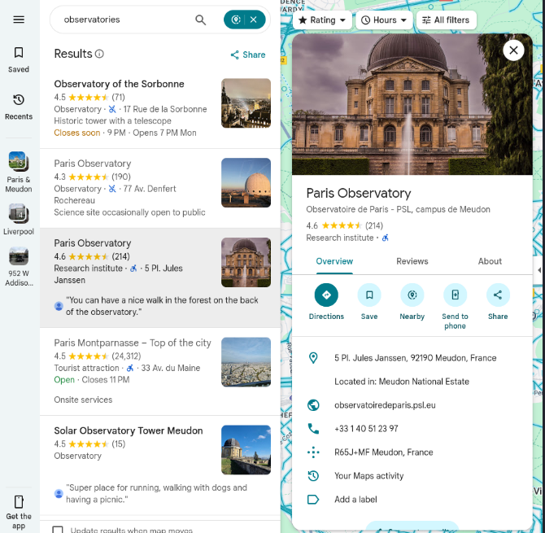

This above one looked a bit different but when I saw it on the map I saw something very similar.

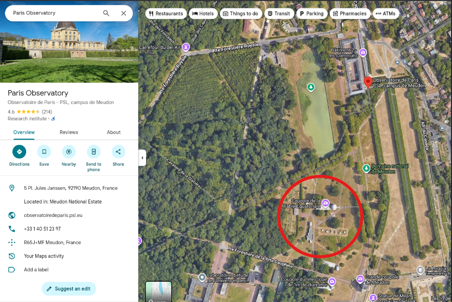

Here, you can see the circled area it is extremely similar to what we saw in the given task image.

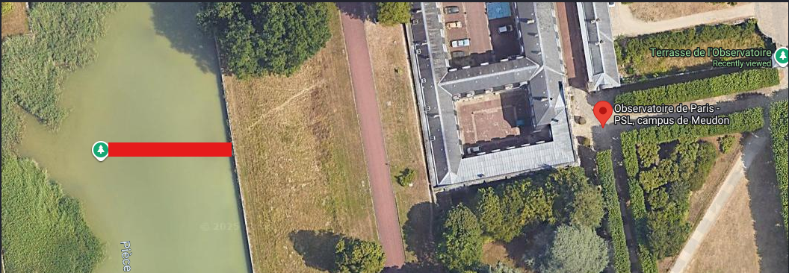

Moving around a bit I saw another name written on the map it was in French and translating it into English gave me the correct answer. You can take hint from how Paris Observatory is called Observatoire de Paris and where is it located.

### Task 7 -> Your turn, what can you see?

Now it was time for our last task i.e. Task 7 . Initially I saw the image and noticed 3 things.

1- There were zigzag lines on the road .

2- Cars were driving on the left side of the road.

3- A monument in the middle of the road.

I searched for these specific lines and got the following results.

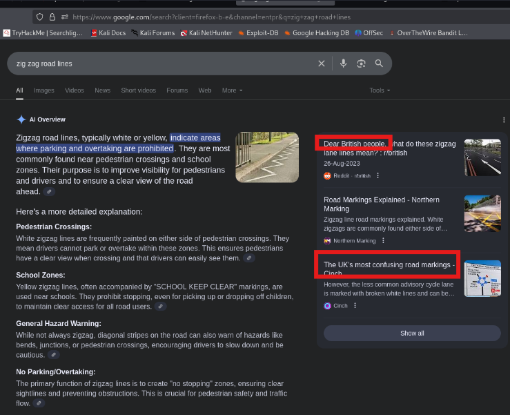

Most of the results hinted towards this pic being in the UK also this conincides with our observation of cars being on the left side of the road.

Now, the next part was searching for the monument and that's when I realized that they never forbade us using reverse image search. Now, I could have kept this going and only reverse image search the monumnet but I just gave the whole image on Yandex and got the following results.

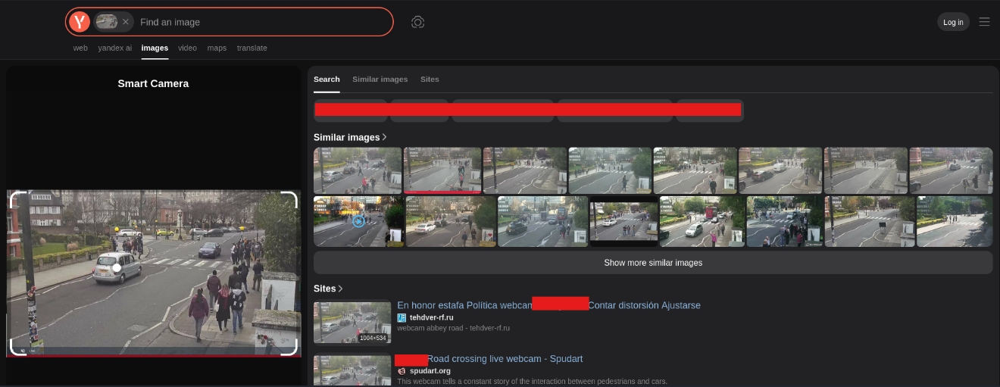

This was the correct answer and just like that we have now compeleted this room successfully.

## Tools Used

Following are some tools that I used in solving this room.

1- [RevEye Reverse Image Search](https://addons.mozilla.org/en-US/firefox/addon/reveye-ris/)  (For firefox)

2- [RevEye Reverse Image Search](https://chromewebstore.google.com/detail/reveye-reverse-image-sear/keaaclcjhehbbapnphnmpiklalfhelgf)  (For Chrome)
