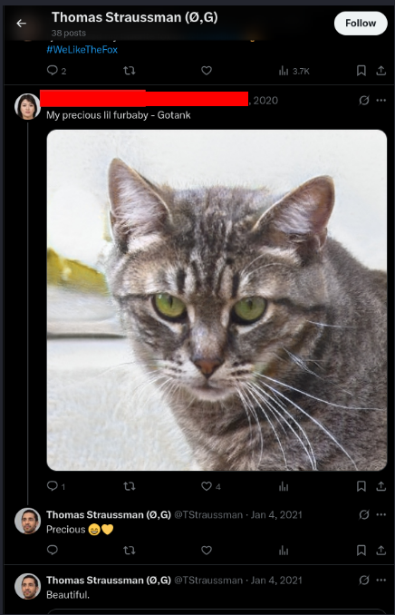
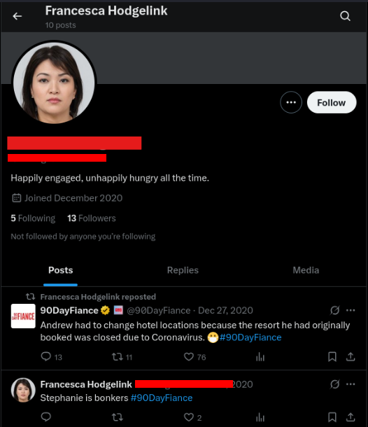
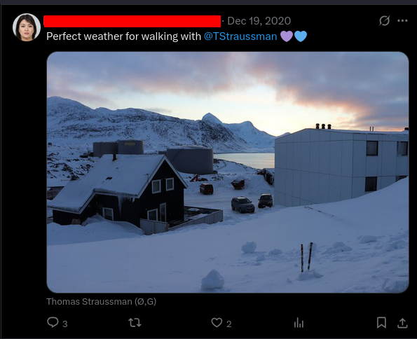
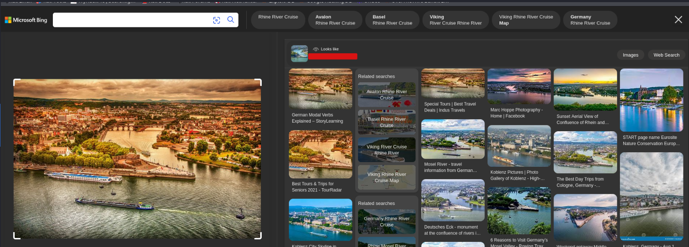

#   KaffeeSec - SoMeSINT

**Room URL:** [KaffeeSec - SoMeSINT](https://tryhackme.com/room/somesint)  
**Difficulty:** Medium  
**Author:** Areeba Zehra Jafri        
**Date Completed:** 17-August-2025

## Room Overview

## Solution Walkthrough

As, we can see in the story above we will have to investigate a suspected cheater and for that in this room we will be utilizing our OSINT skills.

Let's start with Task 2

### Task 2 -> Story

Task 2 is basically an overview of what we have to do and following are the two questions we have.

#### Who hired you?

This answer can be found in the seocnd line , just a one word answer . We will be utilizing flag format ks{} throughout this room where mentioned.

#### Who are you investigating? (ks{firstname lastname})

This too can be found in second line.

Let's move on to Task 3 now, from where our real work will begin.

### Task 3 -> Let's get started!!

We are given Thomas's social media handle i.e. tstraussman. At the time I am writing this writeup the first thought that came to me was that I could've used the following Google advance search operator:

`intitle:tstraussman`

But since, they have already told us that he only has accounts on Reddit and Twitter so, I searched in the following way:

`site:Twitter tstraussman`
`site:Reddit straussman`

This quickly gave us the two accounts now, we have to explore them further.

This is how his reddit account looks like . now before collecting things let's take a look at the questions.

#### What is Thomas' favorite holiday?

There was only one post on his Reddit which was about his birthday . Then I switched to Twitter as a person's favourite holiday is a personal thing and we are most likely to find these things on Twitter. 

Here we had our answer, his favourite holiday was mentioned in his bio.

Here I saw a lot of other things too like his finacee's name was mentioned , his city and country that is Nuuk, Greenland was also mentioned.

#### What is Thomas' birth date?

If you remember we saw only one post on his Reddit and that was about his birthday . 

On his Reddit his birthday was clearly written as Cake Day and the post date was also same as that . We were given a hint that we can also check from the source code too.For that, I just used `CTRL+U` to open page source then found his birhtday there too.

Here I faced a problem , It was the same date everywhere even the format was same but the website was saying answer is wrong. I tried tweaking the date a bit and finally a date of the next day after his Cake day was accepted . This confused me, then I looked through some writeups and most of them showed new date on the website then the one I got . I was confused tried wayback machine but got the same answer . I still don't know what was wrong.

#### What is Thomas' fiancee's Twitter handle?

I looked through who his follows and also his followers but,found all official accounts and nothing that matches his finacee's name . Then I looked through the comments he left on other peoples's posts and found an account on which he has commented on a post that had the same name as his fiancee.

When I opened her account It had a bio that she is engaged which further confirmed that she is the one we were looking for.

After scrolling some of her posts I found the following post where she had mentioned Thomas.

#### What is Thomas' background picture of?

We can see that when we solved the first question. He has even mentioned his name in his bio.

### Task 4 -> Spider... what?

#### What was the source module used to find these accounts?

This was our next question I tried setting up the tool spiderfoot but ended up getting alot of version conflicts. I would suggest all of you to still try the recommended method and try this tool .I ended up trying an alternate approach. On the internet when I searched for source modules in Spiderfoot I got a hint that they start with sfp . Now looking at the screenshots provided by THM we can see the name of the module given . I tried putting that as answer and it was correct. 

#### Check the shadowban API. What is the value of "search"?

Try hackme gave us the account `shadowban.eu` which no longer exists . I tried searching for shadowban again and found that it has now shifted to a new url(I have given the link below) .

Now, I tried the username and it showed that it was not shadowbanned. 

Then right clicked ,opened the web inspector and went to network tab saw the api call there.

In the request we can see that the value of search was given as `_implied_good` but this was not the correct answer . 

Now since, this was a different url I decided to use the wayback machine(link is given below) to access the same url given on THM .

Then, again used the same approach and this time got the correct results.

### Task 5 -> Connections, connections..

Where did Thomas and his fiancee vacation to?

I scrolled through his finacee's post and found a picture of where they went to vacation . 

I already had the revEye extension installed(I have given the install link below) so, right clicked on it and selected the **search by all search engines** . All of them gave the correct answer following is what Bing gave as answer which was in the perfect format.

#### When is Francesca's Mother's birthday? (without the year)

She wished her mother happy birthday on her twitter and the date of the post is the correct answer . However, I think the holiday it coincides with is a better clue.

#### What is the name of their cat?

Remember the post through which we found Francesca's account . That post has the name of the cat .

#### What show does Francesca like to watch?

Looking through her posts I saw she reposted some posts from a show and posted about a character in that series.This is how I found the answer to this question. 

### Task 6 -> Turn back the clock!!

In this task we have to utlize wayback machine and find some info about Thomas's coworker.

Following the instructions in the task I opened Thomas's post on old reddit.

Searching it on wayback machine I found a calender and switched to one of the earliest version of that post.

#### What is the name of Thomas' coworker?

Here we can see comment of his old coworker . He has himself mentioned his name in the comment . removing the first name from the username we will also find the last name and then we will have our answer.

#### Where does his coworker live?

From the above username I opened the reddit profile of his coworker and there I found the name of a city and a country flag in his bio and that was the correct answer .He has also mentioned the name of country in one of his posts . Do you guys remember the place where Thomas lives ? It's the same.

#### What is the paste ID for the link we found? (flag format)

Since, we were working on old reddit I opened his coworker's account in that but still no link was to be seen. Moving forward I opened wayback machine and found two early versions with two different links :

1- 'Disappointed' on Feb 10,2021

It had a link to a website called pastebin. It is a website that allows users to store and share plain text online. It had the following pasteID (pastedID is the string after the last /)

But, This wasn't the correct answer.So, I moved to our second option.

2- 'Disappointed 2 Electric Boogaloo' March 23 , 2021

Following was the post . Now the problem is pastebin has now changed their url format and if you will try to access those links now they won't be accessible. At this point you can either modify those links according to the new format or just like me, access them through the wayback machine.

Below is the paste ID and what we got when we accessed the link.

#### Password for the next link? (flag format)

The password is written in plaintext under the next link.

#### What is the name of Thomas' mistress?

After I accessed the link through previous method it showed us how to acceess a password protected paste.

Then I just crafted the url in the given way and got the access.
This was an email Thomas wrote to his mistress and we can see the mistress's name in her email address.

#### What is Thomas' Email address?

Thomas's email address is also given in the above email.

Just like that we have completed our room.

## Tools Used

Following are some tools that I used in solving this room.

1- [wayback machine](http://wayback.archive.org/)  

2- [RevEye Reverse Image Search](https://addons.mozilla.org/en-US/firefox/addon/reveye-ris/)  (For firefox)

3- [RevEye Reverse Image Search](https://chromewebstore.google.com/detail/reveye-reverse-image-sear/keaaclcjhehbbapnphnmpiklalfhelgf)  (For Chrome)

4- [Shadowban](https://shadowban.yuzurisa.com/)

5- [old reddit](https://old.reddit.com/)

6- [pastebin](https://pastebin.com/)