#   Network Traffic Basics

**Room URL:** [Network Traffic Basics](https://tryhackme.com/room/networktrafficbasics)  
**Difficulty:** Easy    
**Author:** Areeba Zehra Jafri        
**Date Completed:** 21-February-2025       
**Access:** Free

## Room Overview

## Solution Walkthrough

This is a walkthrough type of room that familiarizes us with the basics of network traffic. I will not provide answers directly rather provide the commands I used or screenshots of excerpt from their own explanation . I would highly encourage you all to try these yourself and consider this writeup as a helper in your way.

### Task 2 -> What is the Purpose of Network Traffic Analysis?

#### What is the name of the technique used to smuggle C2 commands via DNS?

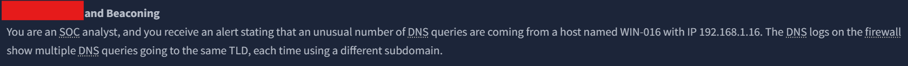

### Task 3-> What Network Traffic Can We Observe?

- All the answers can be found in the given text.

#### Look at the HTTP example in the task and answer the following question: What is the size of the ZIP attachment included in the HTTP response? Note down the answer in bytes.

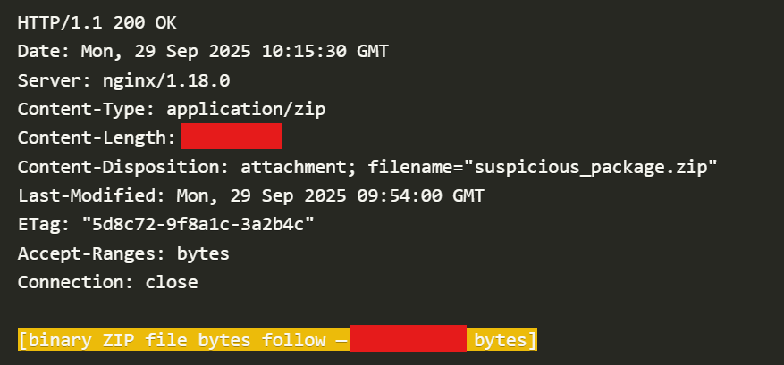

#### Which attack do attackers use to try to evade an IDS?

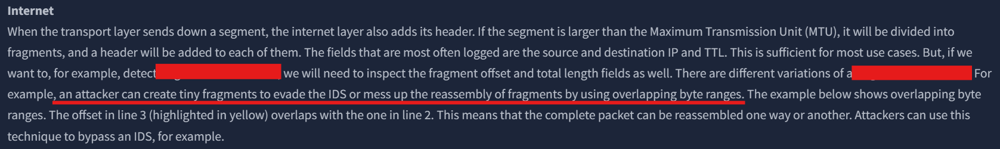

#### What field in the TCP header can we use to detect session hijacking?

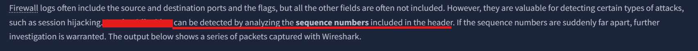

### Task 4 -> Network Traffic Sources and Flows

- Once again all the answers were already present in the text.

#### Which category of devices generates the most traffic in a network?

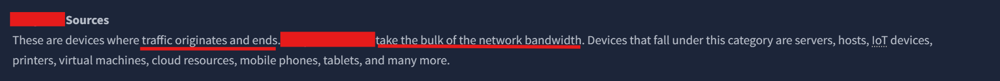

#### Before an SMB session can be established, which service needs to be contacted first for authentication?

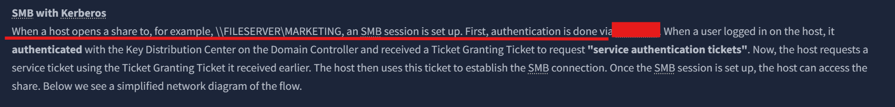

#### What does TLS stand for?

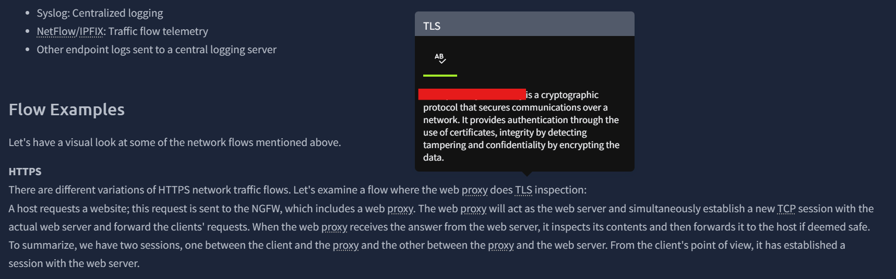

### Task 5 -> How Can We Observe Network Traffic?

- In this task we had to start the machine and solve some exercises.

#### What is the flag found in the HTTP traffic in scenario 1? The flag has the format THM{}.

We had to place the TAP at appropriate place to capture the traffic. Since the scenario was talking about web traffic and HTTP request I placed the TAP at the following place.

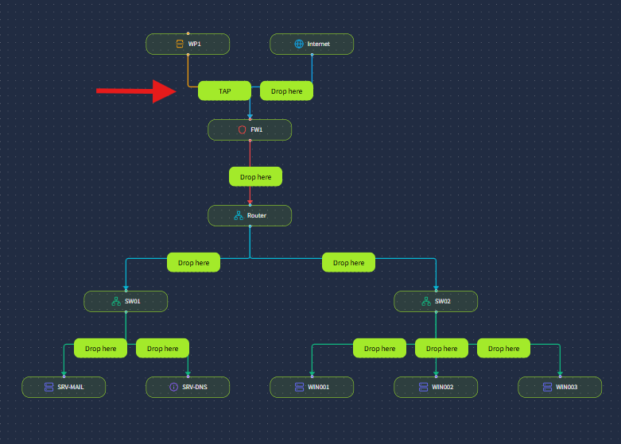

This was the correct place and we got some logs .

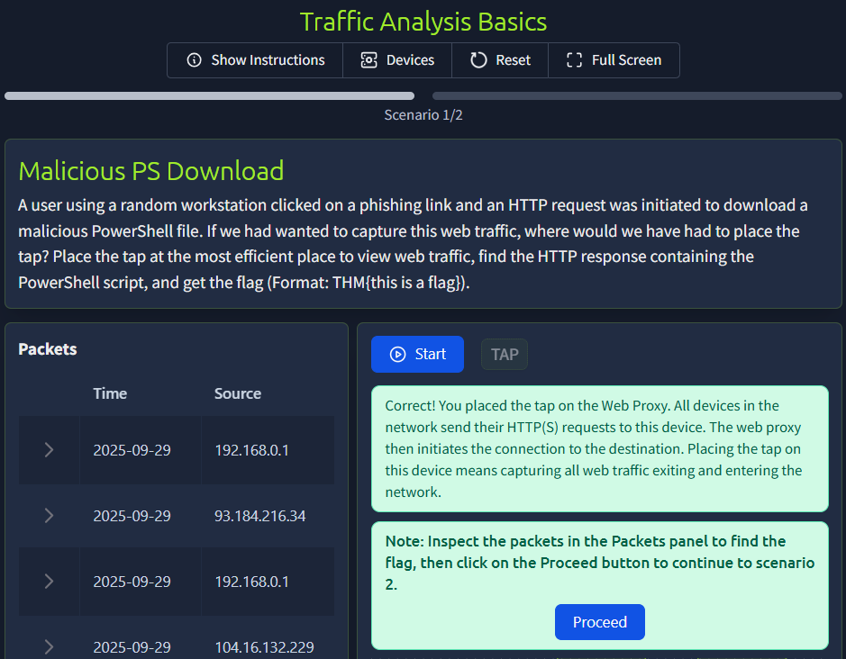

After analyzing them I found the flag in one of them.

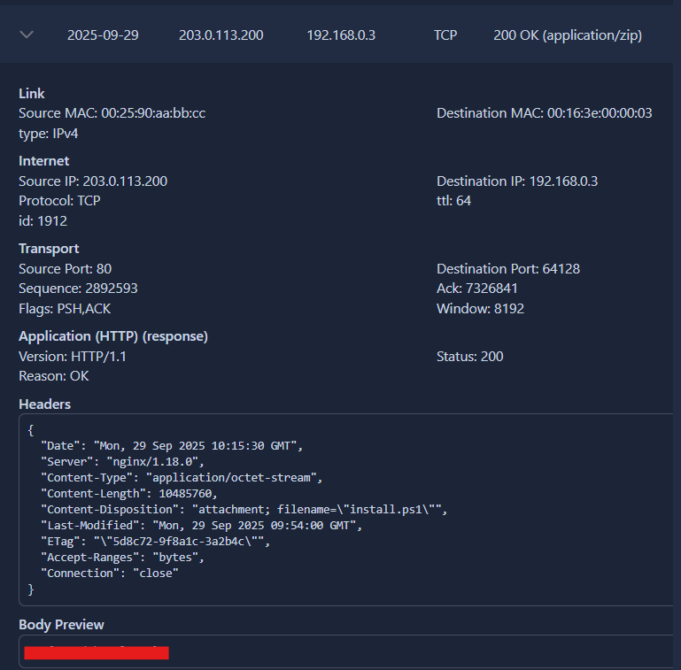

#### What is the flag found in the DNS traffic in scenario 2? The flag has the format THM{}.

Looking at the scenario we can see that the malicious instructions were infiltrated using DNS TXT records. So, I found the following place as the most suitable to place the TAP.

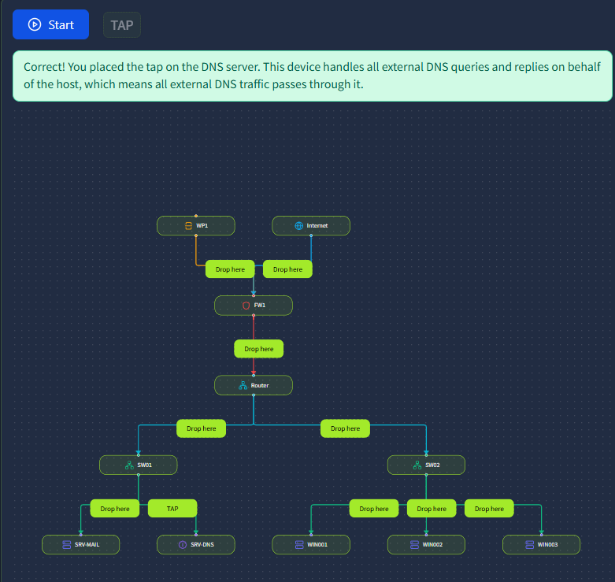

Once again there were alot of logs and I ended up finding the flag in one of them.

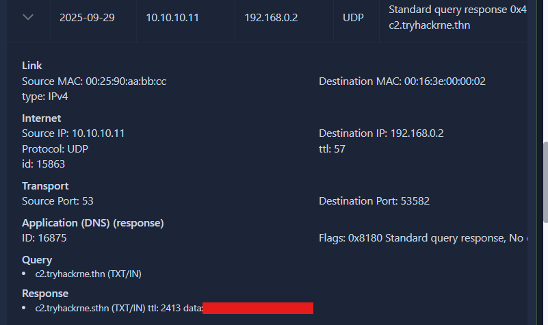

We have completed our room just like that. I hope this writeup was helpful.

## Tool Required

 For solving this room we didn't use any tool but if you want to capture network traffic and study it in detail you can download the following tool.

1- [Wireshark](https://www.wireshark.org/download.html) 

