#   Nmap Live Host Discovery

**Room URL:** [Nmap Live Host Discovery](https://tryhackme.com/room/nmap01)  
**Difficulty:** Medium   
**Author:** Areeba Zehra Jafri        
**Date Completed:** 7-July-2025       
**Access:** Free

## Room Overview

## Solution Walkthrough

This is a walkthrough type of room that was all about how to discover hosts by using nmap. It is part of a 4 course series on nmap . I will not provide answers directly rather provide the commands I used or screenshots of excerpt from their own explanation . I would highly encourage you all to try these yourself and consider this writeup as a helper in your way.

### Task 2 -> Subnetworks

#### How many devices can see the ARP Request?

- I set the values as told in the question and then sent the packet. These blue circles indicate the devices that are recieving the ARP Request.

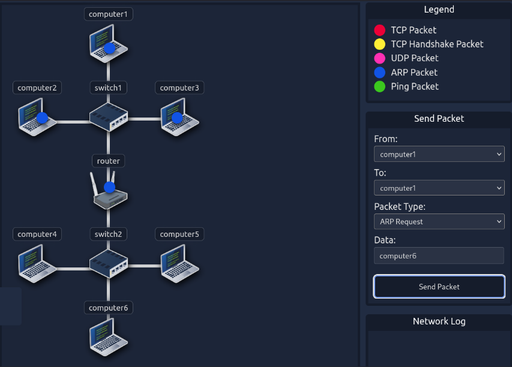

#### Did computer6 reply to the ARP Request? (Y/N)

- The ARP Request didn't even reach computer6 then, how can it reply? Also computer6 is not on the same subnet as computer1 that is sending the request.

Following is for the next setting 

#### How many devices can see the ARP Request?

- Again we can see the packets originating from computer4 and the devices the reach representated by blue circles.

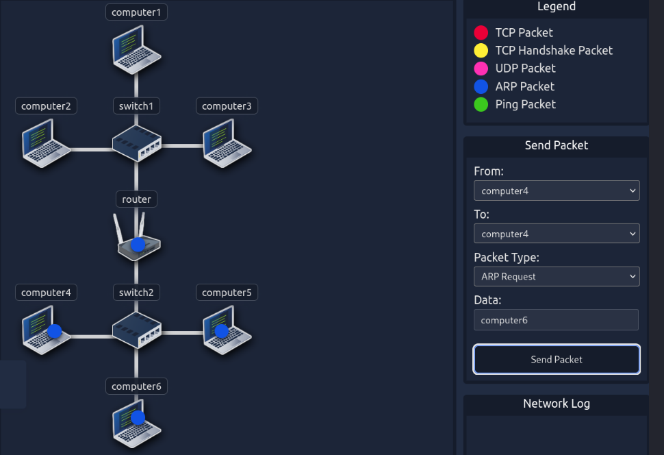

#### Did computer6 reply to the ARP Request? (Y/N)

- This time we can see that both computer4 and computer6 are in the same subnet and computer6 is also receiving the ARP Request.So, the answer is evident.

### Task 3 -> Enumerating Targets

#### What is the first IP address Nmap would scan if you provided 10.10.12.13/29 as your target?

- To solve this question I used the following command and got the answer. 

`nmap -sL 10.10.12.13/29`

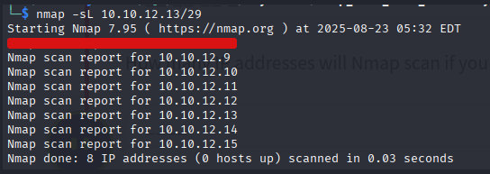

#### How many IP addresses will Nmap scan if you provide the following range 10.10.0-255.101-125? 

- For this question I used the following command:    

`nmap -sL 10.10.0-255.101-125`   

This gave the following output.

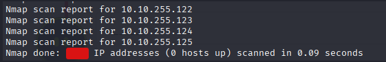

### Task 4 -> Discovering Live Hosts

#### Send a packet with the following:
#### From computer1 To computer3
#### Packet Type: “Ping Request”
#### What is the type of packet that computer1 sent before the ping?

- After we sent the packet logs were generated . We can see from the logs the type of packet it was.

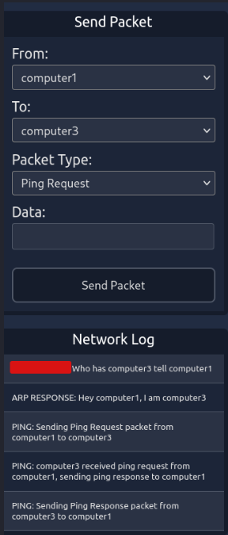

#### What is the type of packet that computer1 received before being able to send the ping?

- Computer 3 received the ARP Request sent by computer1 then , it sent a reply. We can see the type of packet in the logs.

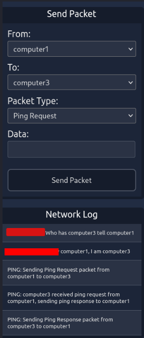

#### How many computers responded to the ping request?

- We can see from the logs who was sent a ping request and who responded .

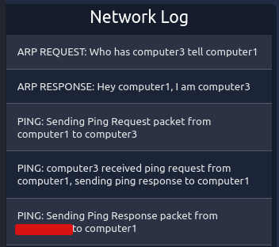

#### Send a packet with the following:

#### From computer2 To computer5
#### Packet Type: “Ping Request”
#### What is the name of the first device that responded to the first ARP Request?

- Computer2 and computer5 both are in a different subnet that means the ping request can't reach computer5 directly from computer1 and it must pass through an intermediary device. We can see what device it was in the logs.

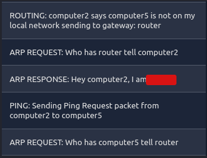

#### What is the name of the first device that responded to the second ARP Request?

- Now the intermediary device has sent an ARP request on the subnet in which computer5 is present we can see in the logs which device responded to it.

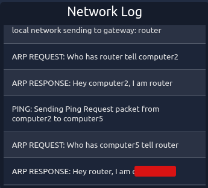

#### Send another Ping Request. Did it require new ARP Requests? (Y/N)

- After the first case now the computer2 also knows the MAC address of router and router also knows the MAC address of computer5 . Now, computer2 knows computer5 is not on the same subnet so it will send ping directly to router and router will forward it directly to computer5. 

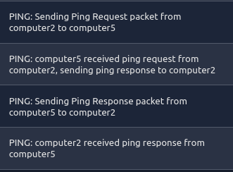

### Task 5 -> Nmap Host Discovery Using ARP

We will be sending broadcast ARP Requests packets with the following options:

From computer1   
To computer1 (to indicate it is broadcast)   
Packet Type: “ARP Request”   
Data: try all the possible eight devices (other than computer1) in the network: computer2, computer3, computer4, computer5, computer6, switch1, switch2, and router.

#### How many devices are you able to discover using ARP requests?

- We know ARP request is a broadcast that always remain within a network . There are total 4 devices on the network of computer1 and we are told to remove computer1 so I guess the answer is clear.

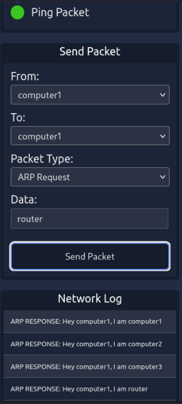

### Task 6 -> Nmap Host Discovery Using ICMP

- I was able to find the answer of all three of the questions given below from the given text so, I have just attached some snippets to show that.

#### What is the option required to tell Nmap to use ICMP Timestamp to discover live hosts?

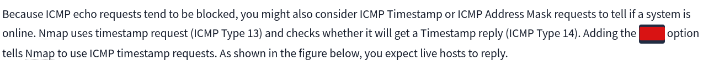

#### What is the option required to tell Nmap to use ICMP Address Mask to discover live hosts?

#### What is the option required to tell Nmap to use ICMP Echo to discover live hosts?

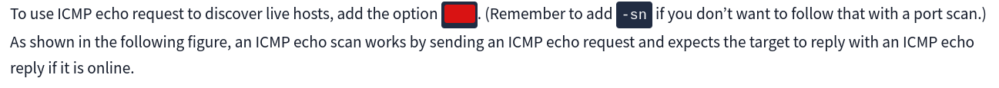

### Task 7 -> Nmap Host Discovery Using TCP and UDP

- Once again the answer for all these was in the text.

#### Which TCP ping scan does not require a privileged account?

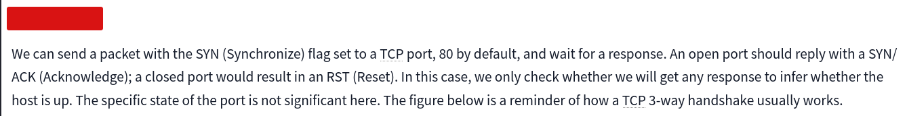

#### Which TCP ping scan requires a privileged account?

#### What option do you need to add to Nmap to run a TCP SYN ping scan on the telnet port?

- telnet runs on port 23. We didn't had the answer directly but they gave as a format as how we can specify a single port.

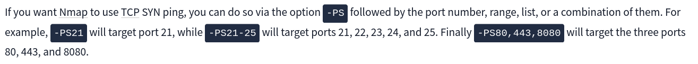

### Task 8 -> Using Reverse-DNS Lookup

#### We want Nmap to issue a reverse DNS lookup for all the possibles hosts on a subnet, hoping to get some insights from the names. What option should we add?

- The text in this portion was so little and the answer was also right infront of us.

We have completed our room just like that. I hope this writeup was helpful.

## Tool Required

1- [Nmap](https://nmap.org/download) 

