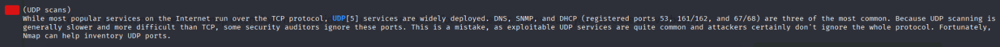
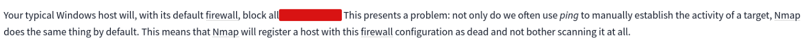
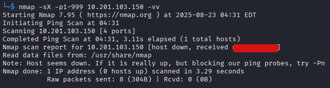

#   Nmap 

**Room URL:** [Nmap](https://tryhackme.com/room/furthernmap)  
**Difficulty:** Easy
**Author:** Areeba Zehra Jafri        
**Date Completed:** 5-July-2025       
**Access:** Free

## Room Overview

## Solution Walkthrough

This is a walkthrough type of room that kind of introduces us to a tool called nmap. This tool is widely used in industry for network scanning and enumeration. I will not provide answers directly rather provide the commands I used or screenshots of excerpt from their own explanation . I would highly encourage you all to try these yourself and consider this writeup as a helper in your way.

The answers for most of the question were found either in the explanation given by THM or by finding in the nmap manual. It can be opened in the following way:

`man nmap`

We can also use the help command which will give us concise answers .

`nmap -help`

### Task 2 -> Introduction

#### What networking constructs are used to direct traffic to the right application on a server?

#### How many of these are available on any network-enabled computer?

#### [Research] How many of these are considered "well-known"? (These are the "standard" numbers mentioned in the task

- I knew this answer previously but just to show we can get the answer from a quick google search , also it was mentioned on the man page too.

### Task 3-> Nmap Switches

All the answers from the following task were on the man page.

#### What is the first switch listed in the help menu for a 'Syn Scan' (more on this later!)?

#### Which switch would you use for a "UDP scan"?

#### If you wanted to detect which operating system the target is running on, which switch would you use?

#### Nmap provides a switch to detect the version of the services running on the target. What is this switch?

#### The default output provided by nmap often does not provide enough information for a pentester. How would you increase the verbosity?

#### Verbosity level one is good, but verbosity level two is better! How would you set the verbosity level to two?
#### (Note: it's highly advisable to always use at least this option)

- The answer for this question is present in the previous screenshot.

#### We should always save the output of our scans -- this means that we only need to run the scan once (reducing network traffic and thus chance of detection), and gives us a reference to use when writing reports for clients.

#### What switch would you use to save the nmap results in three major formats?

#### What switch would you use to save the nmap results in a "normal" format?

#### A very useful output format: how would you save results in a "grepable" format?

#### Sometimes the results we're getting just aren't enough. If we don't care about how loud we are, we can enable "aggressive" mode. This is a shorthand switch that activates service detection, operating system detection, a traceroute and common script scanning.

#### How would you activate this setting?

#### Nmap offers five levels of "timing" template. These are essentially used to increase the speed your scan runs at. Be careful though: higher speeds are noisier, and can incur errors!

#### How would you set the timing template to level 5?

#### We can also choose which port(s) to scan.

- The answers for all port related questions are in the above ss.

#### How would you tell nmap to only scan port 80?

- We will just have to add 80 in the given sample examples.

#### How would you tell nmap to scan ports 1000-1500?

-Here we will have to do the addition of range 1000-1500.

#### A very useful option that should not be ignored:

#### How would you tell nmap to scan all ports?

- Present above.

#### How would you activate a script from the nmap scripting library (lots more on this later!)?

#### How would you activate all of the scripts in the "vuln" category?

- We can search for the NSE script on nmap's official website. I just searched for it directly on the internet.

### Task 4 -> Scan Types Overview

- There were no questions in this.

### Task 5 -> Scan Types TCP Connect Scans

- Answers for both the questions in this task were present in the text.

#### Which RFC defines the appropriate behaviour for the TCP protocol?

#### If a port is closed, which flag should the server send back to indicate this?

### Task 6 -> Scan Types SYN Scans

- The answers for follwoing questions were in the given text.

#### There are two other names for a SYN scan, what are they?

#### Can Nmap use a SYN scan without Sudo permissions (Y/N)?

### Task 7 -> Scan Types UDP Scans

- The answers were present in the given the text.

#### If a UDP port doesn't respond to an Nmap scan, what will it be marked as?

#### When a UDP port is closed, by convention the target should send back a "port unreachable" message. Which protocol would it use to do so?

### Task 8 -> Scan Types NULL, FIN and Xmas

- Once again answers can be easily found in the text.

#### Which of the three shown scan types uses the URG flag?

#### Why are NULL, FIN and Xmas scans generally used?

#### Which common OS may respond to a NULL, FIN or Xmas scan with a RST for every port?

### Task 9 -> Scan Types ICMP Network Scanning

#### How would you perform a ping sweep on the 172.16.x.x network (Netmask: 255.255.0.0) using Nmap? (CIDR notation)

- As similar command was given above using -sn flag we just need to change 192.168 to the given 172.168 

### Task 10 -> NSE Scripts Overview

- Answers were in the text.

What language are NSE scripts written in?
 

Which category of scripts would be a very bad idea to run in a production environment?

### Task 11 -> NSE Scripts Working with the NSE

#### What optional argument can the ftp-anon.nse script take?

- I went to official nmap website and in their scripts section searched for ftp-anon.nse in the description we had arguments mentioned seperately. ( I have attached the link below).

### Task 12 -> NSE Scripts Searching for Scripts

#### Search for "smb" scripts in the /usr/share/nmap/scripts/ directory using either of the demonstrated methods.
#### What is the filename of the script which determines the underlying OS of the SMB server?

- I searched through all the scripts , found one that was related to OS discovery and it was evident from it's name.That was the correct answer.

#### Read through this script. What does it depend on?

- I used the following command to view the contents of the script.

`cat <script_name>`

Then, after skimming through it I found a part where the dependencies were mentioned and there was our answer.

### Task 13 -> Firewall Evasion

#### Which simple (and frequently relied upon) protocol is often blocked, requiring the use of the -Pn switch?

- The answer for this was in the text.

#### [Research] Which Nmap switch allows you to append an arbitrary length of random data to the end of packets?

- Opened the help menu through `nmap -help` and got the answer . 

### Task 14 -> Practical

#### Does the target ip respond to ICMP echo (ping) requests (Y/N)?

- I used the following command to ping the IP and found that it was not responding.

`ping <machine_ip>`

#### Perform an Xmas scan on the first 999 ports of the target -- how many ports are shown to be open or filtered?

- I used the following command and got the output.

`nmap -sX -p1-999 <machine_ip>`

#### There is a reason given for this -- what is it?

#### Note: The answer will be in your scan results. Think carefully about which switches to use -- and read the hint before asking for help!

- Since, the normal output didn't gave us much info I used the verbose flag with it to get a detailed output and sure enough, we got our answer.

#### Perform a TCP SYN scan on the first 5000 ports of the target -- how many ports are shown to be open?

- We can use the following command and just count the number of ports in the output.

`nmap -sS -p1-5000 <machine_ip>`

#### Open Wireshark (see Cryillic's Wireshark Room for instructions) and perform a TCP Connect scan against port 80 on the target, monitoring the results. Make sure you understand what's going on. Deploy the ftp-anon script against the box. Can Nmap login successfully to the FTP server on port 21? (Y/N)

- To complete the above task I used the following command.

`nmap -p21 --script ftp-anon <machine_ip>`

We can see in the output that anonymous FTP login is allowed.

We have completed our room just like that. I hope this writeup was helpful.

## Tool Required

1- [Nmap](https://nmap.org/download) 

2- [NSE Scripts](https://nmap.org/nsedoc/scripts/)

