#   Vulnversity

**Room URL:** [Vulnversity](https://tryhackme.com/room/vulnversity)  
**Difficulty:** Easy      
**Author:** Areeba Zehra Jafri        
**Date Completed:** 1-September-2025

## Room Overview

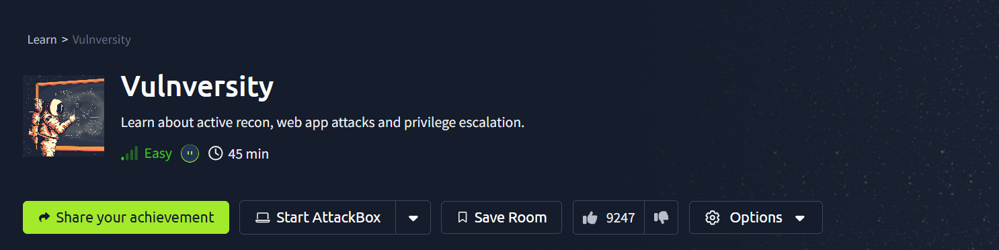

## Solution Walkthrough

This is a walkthrough type of room so alot of steps that we have to take to solve this room ,also their explanation is already provided in the room. We will go through each step and see how can we use what we have learned in this room into practice.

### Task 2 -> Reconnaissance

First step when we have a target is that we have to do reconnaissance on it. For that I will use nmap . I used the following command to scan the given IP.

`nmap -sV <machine_ip>`

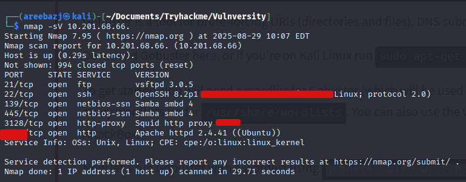

We got the above output from that we can answer the following questions.

#### I- Scan the box; how many ports are open?

- We can just count the number of them from the scan we got.

#### II- What version of the squid proxy is running on the machine?

- Since, we used the -sV flag so we were able to see the version numbers . You can see in the above scan I have hid the version number.

#### III- How many ports will Nmap scan if the flag -p-400 was used?

- The command `-p-<port>` is another way to write `-p1-<port>` . Now we can just count them .

#### IV- What is the most likely operating system this machine is running?

- This info is also available in the scan results.

#### V- What port is the web server running on?

- The port on which web server i.e. http is running is also present above.

#### VI- What is the flag for enabling verbose mode using Nmap?

- The answer for this was present in the explanation provided my THM . You can also use a command `man nmap` in your terminal to open the man page for nmap and find the specific flag and it's description.

    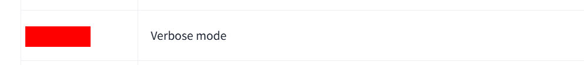

### Task 3 -> Locating directories using Gobuster

- We had to use gobuster for this infact we can use some other tools like dirbuster which has a nice GUI or we can use dirb too. I already had gobuster installed and setup so, I just used the following command to start my enumeration.

    `gobuster dir -u <http://IP:port> -w <wordlist>  `

    Here we used `dir` to mention that we want to do directory busting . The `-u` flag is for URL and `-w` is for wordlist. I used a small wordlists this time.

    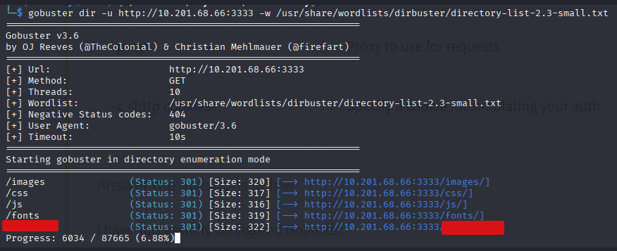

#### I- What is the directory that has an upload form page?

- We can see in the above output that after just few mins we got a suspicious directory. Then I visited the directory in browser and found that there was a file upload option available.

    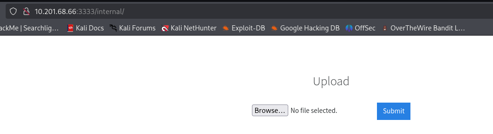

### Task 4 -> Compromise the Webserver

#### I-  What common file type you'd want to upload to exploit the server is blocked? Try a couple to find out.

- Usually we want to upload scripts as files to exploit a server . They can be written in many languages like PHP , Bash, Python etc . In this room we are given a worldlist of extensions which are essentially just some different versions of a language and that is our answer.

#### II- What extension is allowed after running the above exercise?

- Following the given instructions I tried uploading a sample file with .php extension . I captured the request using burp suite . Right clicked on it , sent it to the repeater. There I chose sniper attack. In payload confifuration pasted the given file extensions. Then from then selected the extenion of my uploaded file and clicked on add from positions.  
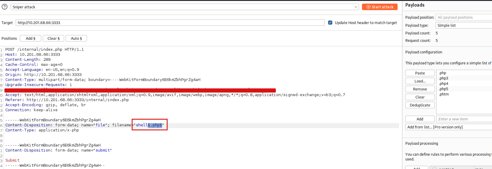
What this will do is that this attack will repeatedly change the selected area where we added $$ with the extensions we have given and try uploading the file each time with a seperate one . After this completed I visited the /uploads/ directory and found the following. 
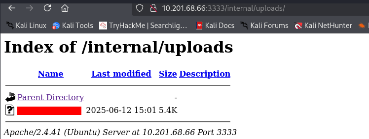
Only one file was successfuly uploaded among all those extensions. What you can do is that you can do this step directly on the file that has the reverse shell. Here , I just uploaded a sample file for checking.
You can do it directly in the following way:
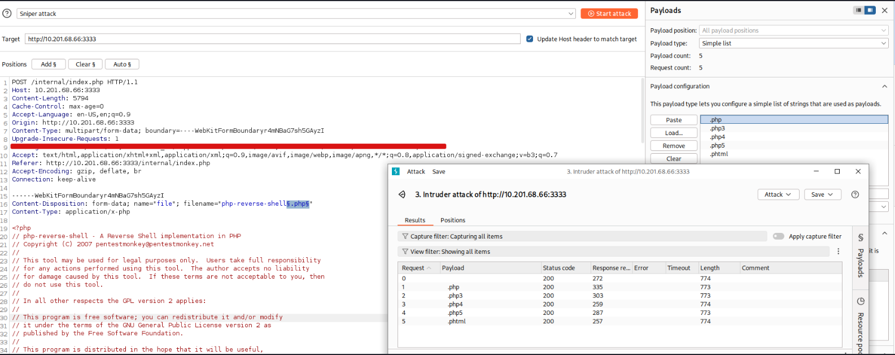

#### III- What is the name of the user who manages the webserver?

- Now to upload the shell I just changed the extension of my file in which I had the shell to the phtml and then uploaded it.
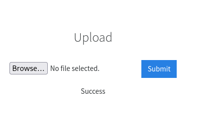

    Then I opened a listener on my device using the given command :

    `nc -lvnp 1234.` 

    After that visited the given link:
`http://MACHINE_IP:3333/internal/uploads/php-reverse-shell.phtml` and just like that our payload ran successfully . We can see that in the following output.

    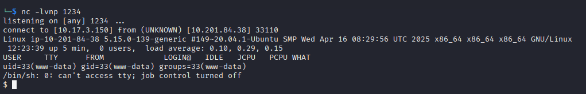

    After that I listed all users in the home directory and found the one we were looking for.

    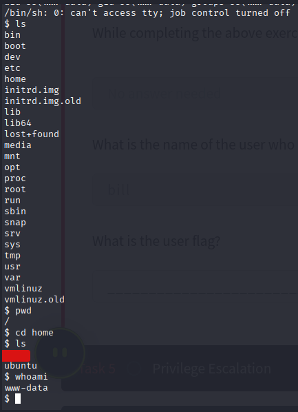

#### IV- What is the user flag?

- In that user's folder we had a file named user.txt that had the flag.

    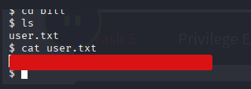

### Task 5 -> Privilege Escalation

#### I- On the system, search for all SUID files. Which file stands out?

- I used the following command to lists all the files that had SUID bit set.

    `find / -perm -400 -user root -type f -exec ls -ldb {} \; 2>/dev/null`

    In this command, I used find / to search the entire filesystem, and the option -perm -4000 to identify files with the SUID bit set, which allows them to run with the privileges of the file owner (in this case root). The flag -user root restricts the search to files owned by root, while -type f ensures only regular files are listed. The -exec ls -ldb {} \; part is used to display detailed information (permissions, owner, group, etc.) for each matching file. Finally, 2>/dev/null suppresses permission-denied errors to keep the output clean.

    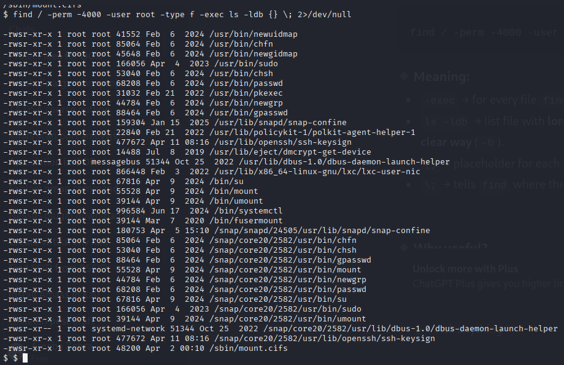

    From the above output there were alot of services but most of them are common to have SUID bit set. But still we had a service `/bin/systemctl` that was of interest to us.

    Normally, /bin/systemctl should not have the SUID bit set. systemctl is the tool used to manage system services, and if it runs with root privileges (because of SUID), any local user could potentially abuse it to start/stop or even create services that execute commands as root. This could easily lead to full privilege escalation.

#### II - What is the root flag value?

- Then I searched on the internet for any exploit for this service and found the following.

    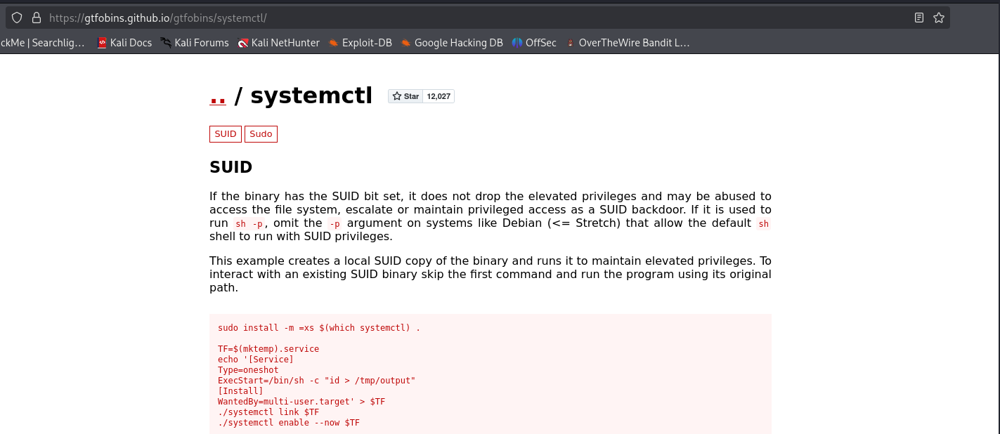

    I modified the exploit a little bit you can see that in the given screenshot below. This final exploit was successful in giving us root shell. This user had a file named root.txt that had our final flag.

    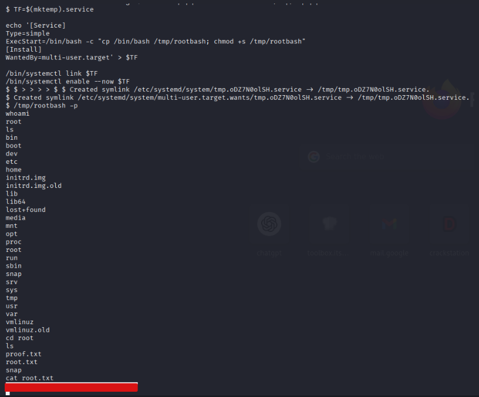

Just like that we have completed our room.

## Tools Used

Following are some tools that I used in solving this room.

1- [nmap](https://nmap.org/)  

2- [Gobuster](https://www.kali.org/tools/gobuster/) 

3- [Burp Suite](https://portswigger.net/burp) 
